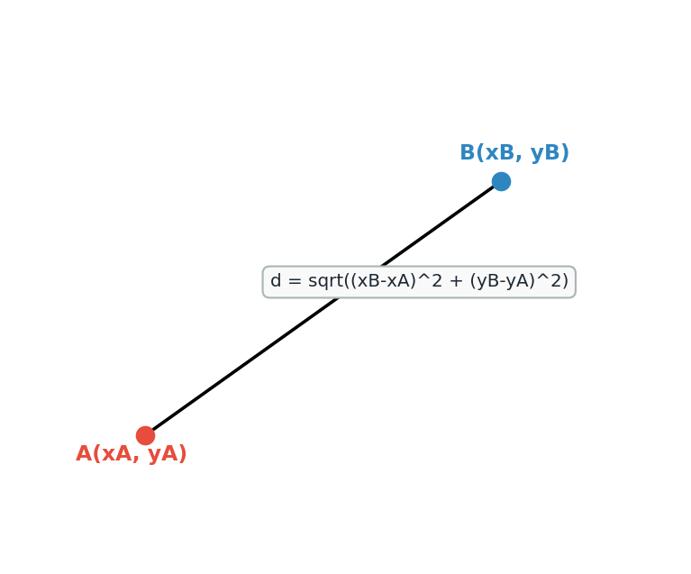
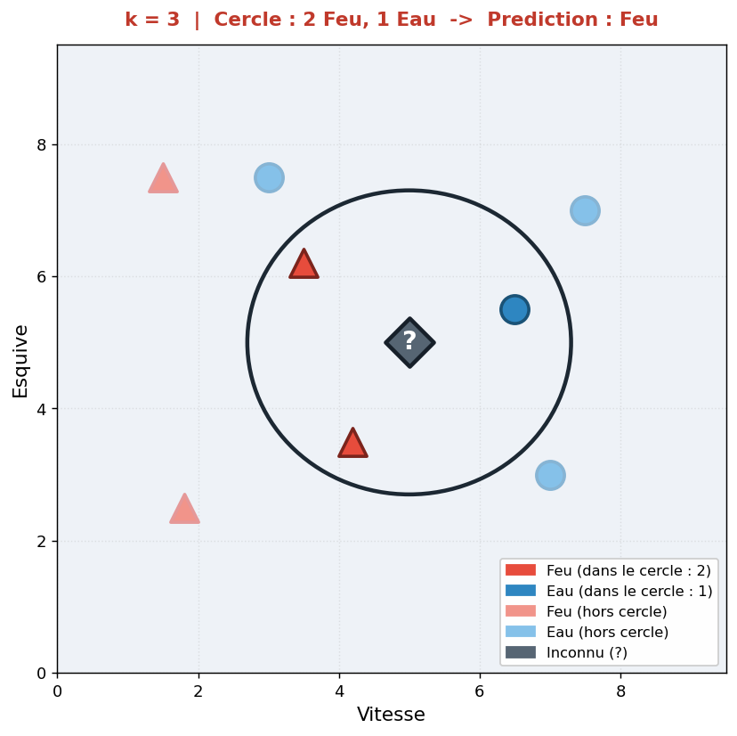
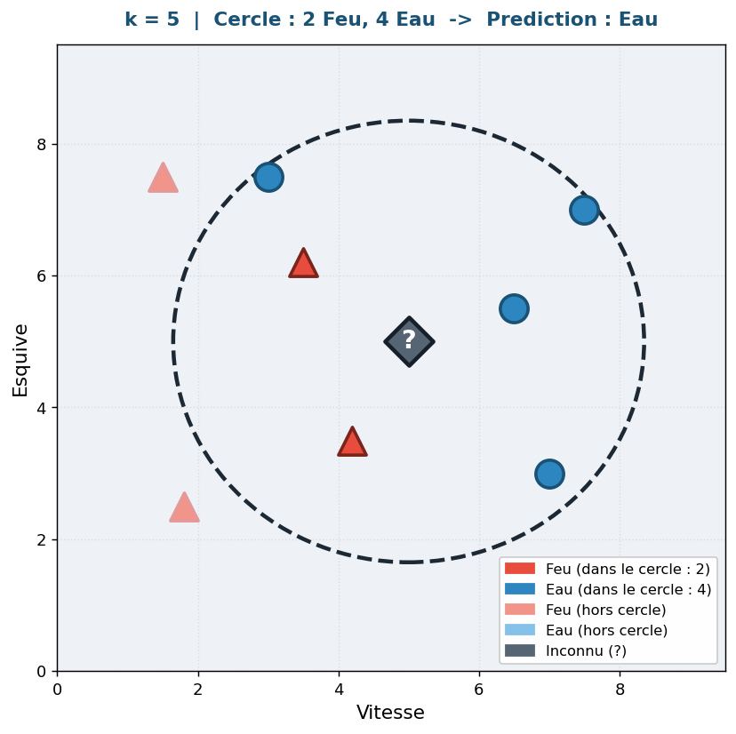

# 🤖 Algorithme des k plus proches voisins (k-NN)

## 1. Introduction à l'apprentissage automatique (Machine Learning)

Dans l'informatique classique, un programme prend des données en entrée et suit une série d'instructions (l'algorithme) pour produire un résultat. 

L'**apprentissage automatique** (*Machine Learning*) propose une approche différente : fournir à la machine des exemples (données + résultats attendus) de manière à ce qu'elle déduise elle-même les règles pour traiter de nouvelles données.

Il existe plusieurs catégories d'apprentissage. Celle qui nous intéresse ici est l'**apprentissage supervisé** : on donne à l'ordinateur un ensemble de données déjà classées (étiquetées), pour qu'il puisse ensuite prédire la classe d'une nouvelle donnée inconnue.

## 2. Principe des k plus proches voisins

L'algorithme des k plus proches voisins (ou *k-NN* pour *k-Nearest Neighbors* en anglais) est l'un des algorithmes d'apprentissage supervisé les plus intuitifs et accessibles.

**Le principe :**
Pour prédire la classe d'un nouvel élément, on va chercher dans nos données d'apprentissage connues les **k éléments qui lui ressemblent le plus** (ses plus proches voisins). On attribue ensuite au nouvel élément la classe qui est **majoritaire** parmi ses k voisins.

!!! note "Analogie"
    "Dis-moi qui sont tes amis les plus proches de toi, et je te dirai qui tu es."

### Les étapes de l'algorithme :
1. Calculer la distance entre le nouvel élément et **tous** les éléments du jeu de données connu.
2. Trier les éléments du jeu de données par distance croissante par rapport au nouvel élément.
3. Sélectionner les **k** premiers (les k plus proches voisins).
4. Déterminer la classe majoritaire parmi ces k voisins.
5. Assigner cette classe majoritaire au nouvel élément.

## 3. Notion de distance

Pour savoir quels éléments sont les "plus proches", il faut définir mathématiquement une notion de proximité, c'est-à-dire une distance. 

Dans un espace à deux dimensions (comme un graphique usuel avec des coordonnées x et y), on utilise très souvent la **distance euclidienne** (la distance classique "à vol d'oiseau").



Si on a deux points A(xA, yA) et B(xB, yB), la distance euclidienne entre A et B est donnée par la formule du théorème de Pythagore :

**d(A, B) = √((xB - xA)² + (yB - yA)²)**

!!! note "Remarque"
    On peut calculer une distance euclidienne dans des espaces de dimension supérieure (avec plus de deux caractéristiques). Par exemple, s'il y a 3 caractéristiques (x, y, z) pour définir notre donnée :
    **d(A, B) = √((xB - xA)² + (yB - yA)² + (zB - zA)²)**

## 4. Un exemple visuel

Imaginons que nous avons classifié des Pokémons en deux catégories : "Feu" (points rouges) et "Eau" (points bleus), en fonction de deux caractéristiques quantifiables (par exemple la *Vitesse* et l'*Esquive*).

On découvre un nouveau Pokémon inconnu. Quelle est sa classe ?

- Si on choisit **k = 3** :
  L'algorithme repère ses 3 plus proches voisins géométriques. Imaginons qu'il y ait 2 types "Feu" et 1 type "Eau". La classe majoritaire est "Feu". Le nouveau Pokémon sera classé "Feu".

  

- Si on choisit **k = 5** :
  On élargit le cercle de recherche à ses 5 plus proches voisins. S'il y a 2 "Feu" et 3 "Eau" pris dans ce cercle, la classe majoritaire bascule. La prédiction sera alors "Eau".

  

!!! note "Le choix de k"
    La valeur du paramètre k a un impact direct sur la prédiction. 

    - On prend très souvent un nombre **impair** pour k (ex: 3, 5, 7...) afin d'éviter les égalités (le "50/50") au moment d'élire la classe majoritaire dans un problème à deux classes.
    - Si k est trop petit (ex: k=1), l'algorithme est très sensible au "bruit" (notre prédiction risque de se caler).
    - Si k est trop grand (ex: égal au nombre total de points du jeu), on se contentera toujours de prédire la classe la plus représentée globalement dans notre base de données initiale, ruinant l'intérêt de la distance.

## 5. Algorithme en pseudo-code

Pour implémenter de façon modulaire cet algorithme, nous avons besoin de :

- `donnees` : une liste des données existantes, préalablement couplées avec leur classe.
- `cible` : la nouvelle donnée dont on cherche à deviner la classe.
- `k` : le nombre de voisins à considérer.

```
Fonction k_plus_proches_voisins(donnees, cible, k):
    distances_voisins = liste vide
    
    // Étape 1 : Calcul des distances
    Pour chaque element dans donnees:
        d = distance(element, cible)
        Ajouter le doublet (d, element.classe) à le liste distances_voisins
    
    // Étape 2 : Tri
    Trier la liste distances_voisins selon les distances croissantes
    
    // Étape 3 : Sélection des k voisins
    voisins_proches = Les k premiers éléments de distances_voisins
    
    // Étape 4 et 5 : Classe majoritaire
    Compter le nombre moyen d'apparitions de chaque classe parmi voisins_proches
    Classe_predite = la classe qui apparait le plus souvent
    
    Renvoyer Classe_predite
```