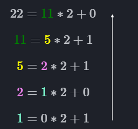

# <u>Nombres binaires et hexadécimaux</u>

## <u>Introduction à la numération binaire</u>

La numération binaire est un système qui utilise seulement deux symboles : 0 et 1.

Contrairement à notre système habituel en base 10 (décimal), qui utilise dix chiffres allant de 0 à 9, la base 2 est le langage fondamental des ordinateurs.

Dans ce système, chaque chiffre correspond à une puissance de deux. Cela permet de représenter n’importe quel nombre uniquement avec des suites de 0 et de 1.

!!! note "Histoire"

    L’idée du binaire remonte au XVIIᵉ siècle grâce au philosophe et mathématicien Gottfried Wilhelm Leibniz. Il a montré que tous les nombres pouvaient être exprimés à l’aide de seulement deux symboles.

    Aujourd’hui, le binaire est indispensable en informatique, car les circuits électroniques ne reconnaissent que deux états : « allumé » (1) ou « éteint » (0).  

    Grâce à cette simplicité, les ordinateurs peuvent effectuer des calculs très complexes et stocker des informations numériques.  


## <u>Définition</u>

**Base :**
La base d’un système de numération est le nombre de symboles différents qu’il utilise pour écrire les nombres.

!!! example "Autres bases utilisées"

    **Base 60 – Temps:**

    Le temps est basé sur la numération en 60 : une heure est divisée en 60 minutes, et une minute en 60 secondes.
    Ce choix vient des Babyloniens, qui comptaient avec un système sexagésimal. Cela rendait les calculs de durées plus faciles à l’époque.

    **Base 12 – Douzaines:**

    Les douzaines (par exemple, les boîtes de 12 œufs) viennent d’un usage ancien. On pouvait compter jusqu’à 12 en utilisant les phalanges des doigts d’une main, en se servant du pouce pour les pointer.

## <u>Base 10</u>

Pour mieux comprendre le principe de la base 2, il est utile de rappeler le fonctionnement du système décimal que nous utilisons au quotidien.

En base 10, chaque chiffre d’un nombre représente une puissance de dix.

!!! example "Exemple"

    Le nombre 347 peut être décomposé ainsi :  

    $$ 347_{10} = 3 × 10^2 + 4 × 10^1 + 7 × 10^0 $$  

    Ici, le chiffre 3 représente trois centaines, le chiffre 4 représente quatre dizaines et le chiffre 7 représente sept unités.  

!!! note "Exercice"

    Décomposez les nombres suivants :  

    - 1235  
    - 1002  
    - 0001  

On note l’ensemble des **chiffres** disponibles en base 10 de la façon suivante :

$$
B_{10} = \{0,1,2,3,4,5,6,7,8,9\}
$$

## <u>Base 2</u>

La base 2 est composée, comme indiqué précédemment, de 2 chiffres :

$$
B_{2} = \{0,1\}
$$

Grâce à la base 2, il est possible de représenter l’ensemble des entiers naturels.
Le principe est le même qu’en base 10 :

* En base 10, lorsque le chiffre des unités vaut 9 et que l’on ajoute 1, il faut remettre le chiffre des unités à 0, puis ajouter 1 au chiffre des dizaines.
* Si le chiffre des dizaines vaut également 9, il faut lui aussi être remis à 0 et ajouter 1 au chiffre des centaines, et ainsi de suite.

!!! example "Exemple"

    Si je veux connaître le nombre qui suit 399, je dois commencer par ajouter 1 au chiffre des dizaines et remettre celui des unités à 0.

    Ici, le chiffre des dizaines vaut aussi 9, donc il faut ajouter 1 au chiffre des centaines, puis remettre le chiffre des dizaines à 0.  

    Ainsi, on obtient 400.  

En base 2, on utilise exactement le même principe.

Comme il n’y a que deux chiffres possibles (0 et 1), dès que l’on atteint 1 dans une position et que l’on ajoute 1, on remet ce chiffre à 0 et on reporte 1 sur la position suivante.

* Par exemple, si le chiffre des unités est 1 et que l’on ajoute 1, il devient 0, et l’on ajoute 1 au chiffre des « dizaines » (en réalité, la deuxième position en base 2).
* Si ce chiffre vaut lui aussi 1, il devient 0 et on ajoute 1 à la position suivante, et ainsi de suite.

!!! example "Exemple"

    Si je veux connaître le nombre qui suit 10011, je dois commencer par ajouter 1 au chiffre des unités. 

    Comme il vaut déjà 1, je le remets à 0 et j’ajoute 1 au chiffre suivant.  

    Or, ce chiffre vaut lui aussi 1, donc je le remets à 0 et j’ajoute 1 au chiffre suivant.  

    Ainsi, j’obtiens 10100.  


!!! note "Exercice"

    Écrire les nombres de 0 à 15 en utilisant la base 2.  

!!! note "Exercice"

    Donner le nombre qui suit chacun des nombres suivants :  

    * 1011  
    * 1111  
    * 1110
    * 1011111

## <u>Passage de la base 2 à la base 10</u>

Pour convertir un nombre écrit en base 10 vers la base 2, on utilise une décomposition en puissances de 2.

!!! example "Exemple"

    Prenons un nombre binaire, par exemple 1011.  

    On peut le décomposer ainsi :  

    $$
    1011_2 = 1 × 2^3 + 0 × 2^2 + 1 × 2^1 + 1 × 2^0
    $$  

    En effectuant le calcul, on obtient :  

    $$
    8 + 0 + 2 + 1 = 11
    $$  

    Donc 1011 en base 2 correspond à 11 en base 10.  


!!! note "Exercice"

    Décomposer les nombres binaires suivants en base 10 :  

    - 1010  
    - 11011  
    - 0011  
    - 1001001101  


## <u>Passage de la base 10 à la base 2</u>

Pour convertir un nombre écrit en base 10 vers la base 2, on utilise ce que l’on appelle **la méthode des divisions successives**.

!!! example "Exemple"


    Soit le nombre `22` en base 10. Nous voulons le convertir en base 2.  

    On commence par diviser le nombre par 2 en utilisant la division euclidienne :  

    $$
    22 = 11 × 2 + 0
    $$  

    On recommence l’opération en prenant le quotient comme nouveau dividende :  

    $$
    11 = 5 × 2 + 1
    $$  

    Puis on continue jusqu’à ce que le quotient soit égal à 0 :  

    $$
    5 = 2 × 2 + 1
    $$  
    $$
    2 = 1 × 2 + 0
    $$  
    $$
    1 = 0 × 2 + 1
    $$  

    Une fois terminé, on conserve les **restes** obtenus en remontant les étapes de bas en haut :  

    {height="20%"}  

    On obtient donc :  

    $$
    22_{10} = 10110_{2}
    $$  


!!! note "Exercice"

    Convertir en base 2 les nombres suivants (écrits en base 10) :  

    - 6  
    - 16  
    - 31  
    - 42  


## <u>Exercice pratique</u>

!!! note "Exercice pratique"

    1. Compléter la fonction suivante :  

    ```python
    def bin_to_dec(nombre: str) -> int:
        """
        Cette fonction transforme un nombre binaire (en chaîne de caractères)
        en sa représentation en base 10.
        """
    ```  

        Indice : utiliser le parcours de chaîne de caractères vu précédemment.  

    2. Compléter la fonction suivante :  

    ```python
    def dec_to_bin(nombre: int) -> str:
        """
        Cette fonction transforme un nombre entier en base 10
        en sa représentation en base 2 (chaîne de caractères).
        """
    ```  

## <u>base 16</u>

En informatique, une autre base très importante est la base hexadécimale (ou hex). Cette base représente les nombres avec 16 symboles.

Cette base est très utile pour divers usages notamment :

* La représentation d'adresse mémoire
* La représentation des couleurs

On peut noter cette base : 

$$B_{16}  = \{0,1,2,3,4,5,6,7,8,9,A,B,C,D,E,F\}$$


## <u>Table de correspondance entre hexadécimal et décimal</u>


| Hex | Dec |   | Hex | Dec |
| --- | --- | - | --- | --- |
| 0   | 0   |   | 8   | 8   |
| 1   | 1   |   | 9   | 9   |
| 2   | 2   |   | A   | 10  |
| 3   | 3   |   | B   | 11  |
| 4   | 4   |   | C   | 12  |
| 5   | 5   |   | D   | 13  |
| 6   | 6   |   | E   | 14  |
| 7   | 7   |   | F   | 15  |

## <u>Passage de la base 10 à la base 16</u>

On va utiliser, une nouvelle fois, la méthode des **divisions successives**, mais cette fois-ci en divisant par 16 et non plus par 2.

!!! example "Exemple"

    Soit le nombre `356` en base 10. Nous voulons le convertir en base 16.  

    On commence par diviser le nombre par 16 en utilisant la division euclidienne :  

    $$
    356 = 22 × 16 + 4
    $$  

    On recommence l’opération en prenant le quotient comme nouveau dividende :  

    $$
    22 = 1 × 16 + 6
    $$  

    Puis on continue jusqu’à ce que le quotient soit égal à 0 :  

    $$
    1 = 0 × 16 + 1
    $$  

    Une fois terminé, on conserve les **restes** obtenus en remontant les étapes de bas en haut :  

    $$
    (1 \; 6 \; 4)_{16}
    $$  

    On obtient donc :  

    $$
    356_{10} = 164_{16}
    $$  

!!! note "Exercice"

    Convertir en base 16 les nombres suivants (écrits en base 10) :  

    - 12
    - 25
    - 31  
    - 42  

## <u>Passage de la base 16 à la base 10</u>

Pour convertir un nombre écrit en base 16 vers la base 10, on utilise une **décomposition en puissances de 16**, exactement comme on l’a fait pour la base 2 avec les puissances de 2.

Chaque chiffre hexadécimal est remplacé par sa valeur décimale (en utilisant le tableau de correspondance vu précédemment), puis multiplié par la puissance de 16 correspondant à sa position.

!!! example "Exemple"

    Soit le nombre `2F` en base 16. Nous voulons le convertir en base 10.  

    On décompose le nombre :  

    $$
    2F_{16} = 2 × 16^1 + F × 16^0
    $$  

    Comme `F` correspond à 15 en décimal, on obtient :  

    $$
    2 × 16^1 + 15 × 16^0 = 32 + 15 = 47
    $$  

    Donc :  

    $$
    2F_{16} = 47_{10}
    $$  

!!! note "Exercice"

    Convertir en base 10 les nombres hexadécimaux suivants :  

    - A  
    - 1C  
    - 3F  
    - 7B  
    - FF  

## <u>Exercice pratique</u>

!!! note "Exercice pratique"

    1. Compléter la fonction suivante :  

    ```python
    def hex_to_dec(nombre: str) -> int:
        """
        Cette fonction transforme un nombre hexadécimal(en chaîne de caractères)
        en sa représentation en base 10.
        """
    ```  

    2. Compléter la fonction suivante :  

    ```python
    def dec_to_bin(nombre: int) -> str:
        """
        Cette fonction transforme un nombre entier en base 10
        en sa représentation en base 16 (chaîne de caractères).
        """
    ```  