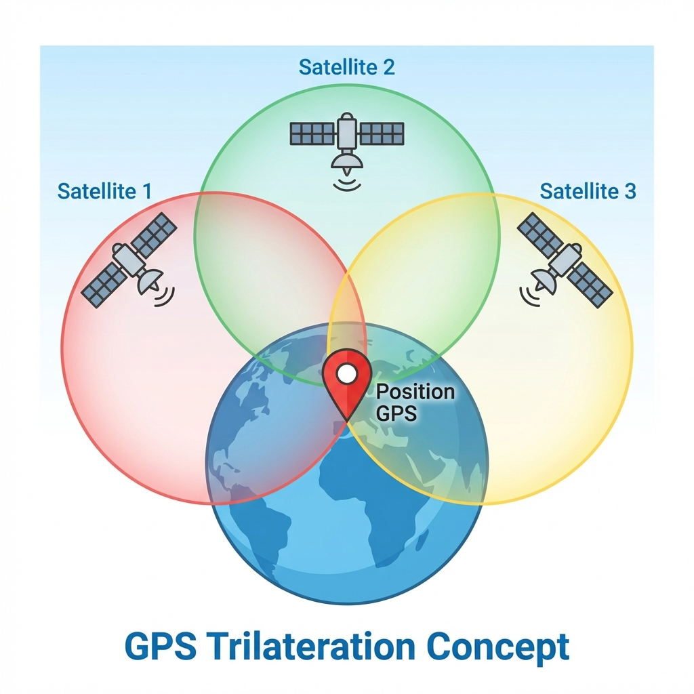

# 🌍 Géolocalisation

## 🤔 Introduction

La géolocalisation est devenue omniprésente dans notre quotidien : smartphones, voitures, montres connectées, applications de livraison... Mais comment fonctionne cette technologie qui permet de situer précisément un objet ou une personne sur la planète ?

Dans ce cours, nous allons découvrir les principes de la géolocalisation par satellite, comprendre le protocole de communication GPS et explorer ses applications concrètes.

## ⌛ Point Historique

*   **Années 1960** : Développement du GPS (Global Positioning System) par l'armée américaine pour des besoins militaires.
*   **Années 1980** : Lancement du premier satellite GPS dans l'espace, marquant le début d'une révolution technologique.
*   **Années 1990** : Le GPS devient accessible au grand public, ouvrant la voie aux applications civiles.
*   **2000s** : Développement d'autres systèmes de géolocalisation :
    *   **Galileo** (Europe) - plus précis que le GPS américain
    *   **GLONASS** (Russie)
    *   **BeiDou** (Chine)
*   **Aujourd'hui** : La géolocalisation est intégrée dans la plupart de nos appareils électroniques.

## 📖 Définitions

!!! note "Géolocalisation"

    La géolocalisation est une technique permettant de situer de manière précise un lieu, une personne ou un objet sur la planète grâce à des coordonnées géographiques.

!!! note "Coordonnées géographiques"

    Pour localiser un point sur Terre, on utilise un système de coordonnées basé sur trois dimensions :
    
    *   **Latitude** : Position Nord-Sud (de -90° à +90°)
    *   **Longitude** : Position Est-Ouest (de -180° à +180°)
    *   **Altitude** : Hauteur par rapport au niveau de la mer

!!! example "Exemple:"

    **Tour Eiffel, Paris** :
    
    *   Latitude : 48.8584° N
    *   Longitude : 2.2945° E
    *   Altitude : ~57 m

---

!!! note "Trilatération"

    La trilatération est la technique mathématique utilisée pour déterminer une position en mesurant les distances depuis au moins trois points de référence connus (les satellites).
    
    Le principe est simple : chaque satellite émet un signal contenant l'heure précise d'émission et sa position. Le récepteur GPS calcule le temps de trajet du signal pour déterminer sa distance à chaque satellite.

!!! example "Exemple:"

    
    
    Imaginez trois cercles dont les centres sont les satellites. L'intersection de ces trois cercles donne votre position exacte.

## 🛰️ Fonctionnement de la géolocalisation par satellite

### Le processus de localisation

Le système GPS fonctionne en plusieurs étapes :

!!! note "Étape 1 : Réception des signaux"

    Le récepteur GPS capte les signaux d'au moins **4 satellites** :
    
    *   **3 satellites** pour déterminer la position (x, y, z)
    *   **1 satellite supplémentaire** pour la synchronisation temporelle

!!! note "Étape 2 : Calcul des distances"

    Grâce au temps de trajet des signaux :
    
    *   **Vitesse du signal** = vitesse de la lumière (300 000 km/s)
    *   **Distance** = Vitesse × Temps de trajet

!!! example "Exemple de calcul:"

    Si un signal met 0.07 secondes pour arriver :
    
    Distance = 300 000 km/s × 0.07 s = 21 000 km

!!! note "Étape 3 : Résolution mathématique"

    Le récepteur résout un système d'équations pour trouver le point d'intersection des sphères centrées sur chaque satellite.

!!! warning "Précision"

    La précision dépend de nombreux facteurs :
    
    *   Nombre de satellites visibles
    *   Conditions météorologiques
    *   Obstacles (bâtiments, relief)
    *   Qualité du récepteur
    
    **Précision typique** : 5 à 10 mètres (GPS civil)  
    **Précision Galileo** : 1 mètre

### Applications : Le calcul d'itinéraires

Une fois la position déterminée, les systèmes de navigation utilisent des algorithmes de routage pour calculer le meilleur chemin entre deux points.

!!! note "Paramètres pris en compte"

    *   **Distance** : Chemin le plus court
    *   **Temps** : Trajet le plus rapide
    *   **Type de route** : Autoroutes, nationales, départementales
    *   **Trafic en temps réel** : Bouchons, accidents
    *   **Coût** : Péages, consommation de carburant
    *   **Préférences** : Éviter les autoroutes, routes touristiques

!!! example "Exemple concret : Trajet Paris → Lyon"

    | Type d'itinéraire | Route | Durée | Distance |
    | :--- | :--- | :---: | :---: |
    | **Rapide** | A6 (autoroute) | 4h30 | 465 km |
    | **Économique** | Routes nationales | 6h15 | 445 km |
    | **Touristique** | Routes départementales | 7h00 | 520 km |

!!! note "Technologies utilisées"

    Les applications comme Google Maps, Waze ou Plans combinent :
    
    *   Données cartographiques statiques
    *   Informations trafic en temps réel
    *   Signalements utilisateurs (accidents, travaux)
    *   Intelligence artificielle pour prédire les conditions

## 📡 Le protocole NMEA-0183 : Communication des données GPS

!!! note "Protocole NMEA-0183"

    Le protocole NMEA-0183 est un standard de communication développé par la National Marine Electronics Association (NMEA) pour transmettre les données de géolocalisation sous forme de trames textuelles facilement décodables.
    
    Ce protocole permet aux récepteurs GPS de communiquer leurs informations de position à d'autres appareils (ordinateurs, smartphones, systèmes de navigation).

### Formats de coordonnées

Il existe plusieurs façons d'exprimer les coordonnées géographiques :

!!! note "Format décimal"

    Le plus simple et le plus utilisé en informatique.
    
    **Exemple** : 48.8584° N, 2.2945° E

!!! note "Format degrés-minutes (DM)"

    Utilisé par les GPS et le protocole NMEA.
    
    **Exemple** : 48° 51.504' N, 2° 17.670' E

!!! note "Format degrés-minutes-secondes (DMS)"

    Le plus précis, utilisé en cartographie.
    
    **Exemple** : 48° 51' 30.24" N, 2° 17' 40.20" E

!!! warning "Conversion"

    **1 degré = 60 minutes**  
    **1 minute = 60 secondes**
    
    Pour convertir 48.8584° en DM :
    
    *   Partie entière : 48°
    *   Partie décimale : 0.8584 × 60 = 51.504'
    *   Résultat : 48° 51.504'

### Structure d'une trame NMEA

!!! example "Exemple de trame GPGGA (position GPS)"

    ```
    $GPGGA,064036.289,4836.5375,N,00740.9373,E,1,04,3.2,200.2,M,,,,0000*0E
    ```

!!! note "Décodage de la trame"

    | Champ | Valeur | Signification |
    | :--- | :--- | :--- |
    | `$GPGGA` | - | Type de trame (position GPS) |
    | `064036.289` | 06:40:36.289 | Heure UTC |
    | `4836.5375,N` | 48° 36.5375' N | Latitude |
    | `00740.9373,E` | 7° 40.9373' E | Longitude |
    | `1` | 1 | Qualité du signal (1 = GPS fixe) |
    | `04` | 4 | Nombre de satellites utilisés |
    | `3.2` | 3.2 | Précision horizontale |
    | `200.2,M` | 200.2 m | Altitude |
    | `*0E` | 0E | Checksum (vérification) |

!!! example "Localisation"

    Cette trame correspond à la position de **Paris, France**.
    
    *   Latitude : 48° 36.5375' N = 48.6090° N
    *   Longitude : 7° 40.9373' E = 7.6823° E

## 🎯 Applications pratiques

La géolocalisation est utilisée dans de nombreux domaines :

!!! note "Navigation"

    *   GPS automobile
    *   Applications de navigation (Google Maps, Waze)
    *   Randonnée et sports outdoor

!!! note "Transport et logistique"

    *   Suivi de colis
    *   Gestion de flottes de véhicules
    *   Applications de VTC (Uber, Bolt)

!!! note "Réseaux sociaux"

    *   Géotagging de photos
    *   Check-in sur Facebook, Instagram
    *   Snapchat Map

!!! note "Sécurité"

    *   Localisation d'urgence (appel au 112)
    *   Antivol de véhicules
    *   Surveillance parentale

!!! note "Jeux et divertissement"

    *   Pokémon GO
    *   Geocaching
    *   Réalité augmentée

## ⚠️ Enjeux et perspectives

La géolocalisation soulève des questions importantes :

!!! warning "Vie privée"

    *   **Traçabilité des déplacements** : Vos mouvements peuvent être enregistrés
    *   **Données personnelles** : Risque de collecte et revente de données
    *   **Surveillance** : Utilisation à des fins de contrôle

!!! danger "Attention"

    La géolocalisation peut être utilisée à des fins de surveillance. Il est important de maîtriser les paramètres de confidentialité de vos appareils :
    
    *   Désactiver la géolocalisation quand elle n'est pas nécessaire
    *   Vérifier les autorisations des applications
    *   Supprimer les métadonnées GPS des photos avant partage

!!! note "Sécurité technique"

    *   **Dépendance aux satellites** : Vulnérabilité en cas de panne
    *   **Interférences** : Brouillage volontaire ou involontaire
    *   **Précision** : Amélioration continue (Galileo, GPS III)

!!! example "Applications futures"

    *   **Véhicules autonomes** : Navigation précise au centimètre
    *   **Internet des Objets (IoT)** : Suivi d'objets connectés
    *   **Réalité augmentée** : Superposition d'informations géolocalisées
    *   **Drones** : Livraisons et surveillance
    *   **Agriculture de précision** : Optimisation des cultures

## 🔍 Pour aller plus loin

!!! tip "Ressources"

    *   [Activité interactive : Trilatération](https://parcours.algorea.org/fr/a/88752303685492924;p=4702,1067253748629066205,183305583351435935,1207970506541061357,237778358454750514;a=0)
    *   [NMEA Decoder en ligne](https://rl.se/gprmc)
    *   [Calculateur de distances GPS](https://www.lexilogos.com/calcul_distances.htm)
