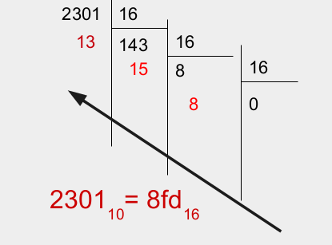

## base 

passage d'une base a une autre

pour passer de la base 10 a la base 16 il faut faire des divisions successive par 16 du nombre jusqu'a obtenir 0.

une fois c'est divisions effectuet on garde seulement le reste de chaque division

pour passer de la base 16 a la base 10 il faut poser le calcule suivant

$$16^n*n_i + 16^{n-1} * n_{n_i-1} + ... + 16^1*n_1 + 16^0*n_0$$

exemple:

$$A3F$$

$$16^2*10 + 16^1 * 3 + 16^0*15$$
