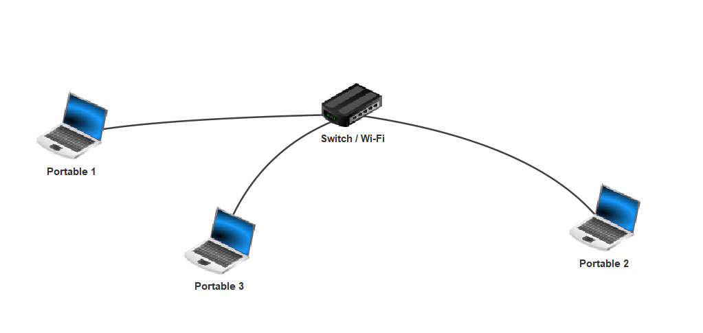

# <u>Internet</u>

## <u>🤔 Introduction</u>

Internet fait aujourd’hui partie de notre quotidien : on l’utilise pour envoyer des messages, regarder des vidéos, jouer en ligne, faire des recherches… Mais comment ça fonctionne vraiment ?

Voici quelques questions que vous vous êtes peut-être déjà posées :

* Comment mon téléphone arrive-t-il à parler avec un autre à l’autre bout du monde ?

* Qu’est-ce qu’il se passe quand je tape une adresse dans mon navigateur ?

* Comment les machines savent à qui envoyer les données ?

* Pourquoi a-t-on parfois besoin d’une box pour se connecter ?

* C’est quoi une adresse IP ou une adresse MAC ?

* Qu’est-ce qu’un réseau exactement ?

Dans cette leçon, nous allons répondre à toutes ces questions en découvrant comment les machines communiquent entre elles, quels sont les composants d’un réseau, et comment les informations circulent sur Internet.

## <u>⌛ Point historique</u>

## <u>Définitions</u>

Définition : réseau

**Ensemble de machines reliées entre elles de telle sorte qu'elles puissent communiquer ensemble.**

!!! note "types de réseaux"

    On distingue plusieurs types de réseaux, dont le réseau local.

    Définition : réseau local

    **Un réseau où les machines peuvent communiquer directement entre elles sans passer par d'autres réseaux.**

    Exemple : un réseau domestique

    

Définition : Internet

**Un immense réseau qui relie tous les petits réseaux du monde pour que les machines puissent s’envoyer des messages, partager des fichiers, ou afficher des sites web.**

## <u>🧩 Composants d’un réseau</u>

Voici un tableau récapitulatif des éléments que l'on peut croiser dans un réseau :

| Élément       | Rôle                                                                          | Exemple                                      |
| ------------- | ----------------------------------------------------------------------------- | -------------------------------------------- |
| Machines      | Élément qui cherche à communiquer, envoyer ou recevoir des données            | Ordinateur, tablettes, consoles, smartphones |
| Switch        | Élément qui relie de manière locale des machines                              | Box Internet, switch RJ45                    |
| Routeur       | Élément qui permet de relier un réseau local à Internet ou à d'autres réseaux | Box Internet, routeur spécifique             |
| Câbles, ondes | Élément qui permet de relier les machines au switch ou au routeur             | Câble Ethernet, fibre optique, Wi-Fi         |

## <u>🆔 Identifiants des machines sur un réseau</u>

### <u>Premier niveau : l'adresse MAC</u>

Chaque machine dispose d’une ou plusieurs **cartes réseau**. Ces cartes permettent de communiquer localement ou globalement.

Chaque carte possède un identifiant unique appelé **adresse MAC** (Media Access Control).

Une adresse MAC est composée de 6 blocs de 2 caractères hexadécimaux.

&nbsp;
&nbsp;

Exemple :
$$a1:b2:c3:d4:e5:f6$$

!!! note "La base hexadécimale"

    La base hexadécimale correspond à une représentation en 16 caractères de chiffres ou de lettres des nombres. Les caractères vont de 0 à F (F représentant 15 en base décimale).

    | nombre hexadécimal | 0 | ... | 9 | A  | B  | C  | D  | E  | F  |
    | ------------------ | - | - | - | -- | -- | -- | -- | -- | -- |
    | nombre décimal     | 0 | ... | 9 | 10 | 11 | 12 | 13 | 14 | 15 |

### <u>Second niveau : l'adresse IP</u>

L’adresse MAC permet d’identifier précisément une machine, mais ne donne aucune information sur son emplacement dans un réseau. Il existe donc une seconde adresse attribuée à chaque machine : **l’adresse IP**.

L'adresse IP est attribuée aux machines présentes sur un réseau afin qu’elles puissent être identifiées de manière plus globale.

Elle est composée de deux parties :

* La **partie réseau** : elle permet d’identifier un réseau sur Internet.
* La **partie machine** : elle permet d’identifier une machine sur ce réseau.

Une adresse IP est composée de 4 nombres allant de 0 à 255 sous forme binaire.

&nbsp;
&nbsp;

Exemple :

Sous forme décimale :
$$127.0.0.1$$

Sous forme binaire :
$$01111111.00000000.00000000.00000001$$

!!! note "La base hexadécimale"

    La base hexadécimale correspond à une représentation en 2 caractères de chiffres des nombres. Les caractères vont de 0 à 1.

    | nombre décimal | 0 | 1 | 2 | 3 | 4 | 5 | 6 | 7 | 8 |
    | ------------------ | - | - | - | -- | -- | -- | -- | -- | -- |
    | nombre binaire     | 0 | 1 | 10 | 11 | 100 | 101 | 110 | 111 | 1000 |

&nbsp;
&nbsp;

Afin de délimiter la partie réseau de la partie machine, on utilise un **masque de sous-réseau**.

&nbsp;
&nbsp;

Exemple :

On dispose de l'adresse `128.40.94.3` avec un masque de 16 bits(soit les 16 premier bit de l'adresse coresponde à la partie réseau et le reste des bits à la partie machine)

Cela correspond en binaire à :
$$128.40.94.3_{10} = 10000000.00101000.01011110.00000100_2$$

Le masque de sous-réseau etant de 16 bits il correspond donc à:
$$11111111.11111111.00000000.00000000_2$$

si maintenant on apllique le masque de sous resaux sur l'adresse ip:
$$ \ \ \ \  \underline{10000000.00101000}.01011110.00000100_2 $$
$$ \& \  \underline{11111111.11111111}.00000000.00000000_2 $$
$$ = \underline{10000000.00101000}.00000000.00000000_2 $$

donc la partie resaux de cette adresse est `128.40.0.0`

&nbsp;
&nbsp;

## <u>🔁 Échange d’informations</u>

Maintenant que nous savons comment les machines s’identifient entre elles, intéressons-nous à la manière dont elles échangent des informations.

Définition : protocole
Un **protocole informatique** est un ensemble de règles qui régissent les échanges entre machines.

Définition : protocole TCP/IP
Le **protocole TCP/IP** permet la communication et l’échange de données sur Internet entre une machine émettrice et une machine réceptrice.

Ce protocole est composé de deux sous-protocoles :

* Le **protocole TCP** permet le contrôle et la sécurité de l’envoi des paquets. Il permet de s’assurer qu’un paquet est bien arrivé à destination à l’aide d’accusés de réception.
* Le **protocole IP** permet d’identifier quelles machines sur quels réseaux communiquent, à l’aide de leur adresse IP.

!!! note "fonctionnement protocole"

    Le protocole TCP/IP fonctionne en plusieurs étapes :

    1. Les données à échanger sont découpées en plusieurs **paquets** (séquences de 0 et 1) de taille définie et numérotés.
    2. Les paquets transitent du point de départ à la machine de destination.
    3. Tous les paquets sont reconstruits à l’aide de leur numérotation.
    4. Un **contrôle d’intégrité** est effectué par la machine réceptrice pour s’assurer que les données sont complètes et correctes. Si ce n’est pas le cas, la machine demande la retransmission des paquets défectueux.
