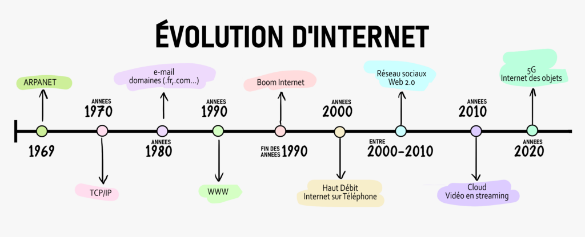
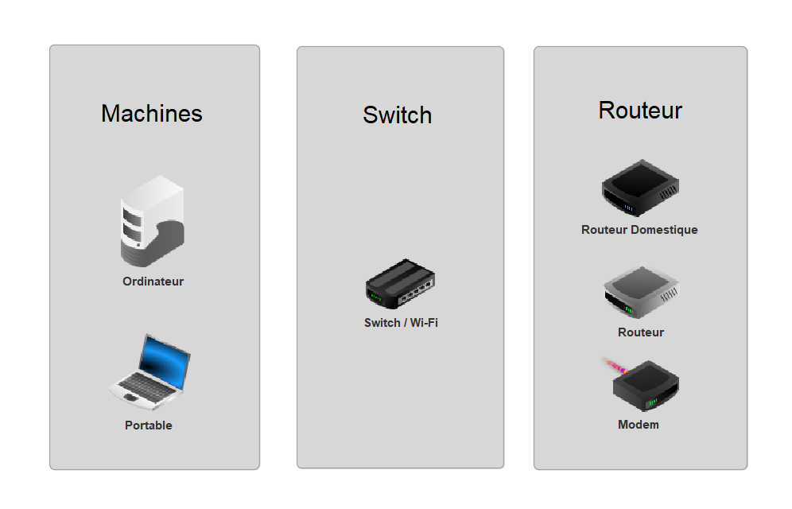

# Internet

## <u>🤔 introduction</u>

l'objectif de cette lecons est de permettre de mieux comprendre le fonctionnement d'internet, d'etudier ces principe et sa mise en oeuvre

## <u>⌛ point historique</u>

## <u>definition</u>

definition: resau

**ensemble de machine relier entre elle de telle sorte qu'elle puisse communiquer ensemble**  

on distingue plusieur type de resaux dont le resaux local 

definition: resau local

**un resau ou les machines peuvent communiquer directement entre elles sans passer par d'autres réseaux**

Exemple: un resau domestique

## <u>composant d'un resaux</u>

voici un tableau recapitulatif des elements que l'on peux croiser dans un resaux

| élément | rôle | exemple |
|----------|--------------------------------------------------------------------|----------------------------------------------|
| Machines | Élément qui cherche à communiquer, envoyer ou recevoir des données | ordinateur, tablettes, consoles, smartphones |
| Switch | Élément qui relie de manière locale des machines | box internet, switch RJ45 |
| Routeur | Élément qui permet de relier un réseau local à Internet ou d'autres réseaux | Box internet, routeur spécifique |
| Cables, Ondes | Élément qui permet de relier les diverses machines au Switch ou au routeur| Câble Ethernet, Fibre optique, WiFi|

## <u>echange d'information sur un resaux</u>

### <u>premier niveau l'adresse mac</u>

chaque machine dispose d'une ou plusieur **cartes reseau**. ces carte permettent de communiquer local ou global

chaque carte possede un identifiant unique appeler l'adresse MAC (Media Access Control)

une adresse mac est composer de 6 blocs de 2 caractères hexadécimaux.

Exemple:

a1:b2:c3:d4:e5:f6

> La base hexadécimale correspond à une représentation en 16 caractères de chiffres ou de nombres. les chiffres qui la compose vont de 0 a F (F representant 15 en base decimal) avec les caractere suivant: 1, 2, 3, 4, 5, 6, 7, 8, 9, A, B, C, D, E et F

### <u>second niveaux l'adresse ip</u>

l'adresse mac permet de connaitre l'identifiant precis d'une machine, cependant elle ne donne aucune informations suplementaire. il existe donc une seconde adresse attribuer au machine qui est l'adresse ip.

l'adresse ip est attribuer par le resaux afin de pouvoir etre identifier en dehors de cellui-ci

L'adresse IP est constituée de 2 parties :

* La partie Réseau : elle permet d'identifier un réseau sur Internet.
* La partie Machine : elle permet d'identifier une machine sur le réseau défini.

Une adresse IP est constituée de 4 nombres allant de 0 à 255.

Exemple:

127.0.0.1
