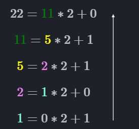

# <u>TD Internet</u>

## <u>Base 2</u>

### <u>passage de la representation en base 10 a la representation en base 2</u>

Afin de passer d'un nombre representait en base 10 (soit celle utiliser au quotidien) a un nombre representait en base 2 on utilise ce que l'on appele la methode de la division successive

Exemple :

Soit le nombre `22` representait en base 10. On desire representait ce nombre en base 2.

on divise le nombre par 2 a l'aide de la division euclidienne:

$$ 22 = 11 * 2 + 0$$

nous allons ensuite repreter cette operation en passant le quotient en dividende

$$ 22 = \color{green}{11} * 2 + 0$$
$$ \color{green}{11} = 5 * 2 + 1$$

finalement on s'arrete lorsque le quotient est egale a 0

$$ 22 = \color{green}{11} * 2 + 0$$
$$ \color{green}{11} = \color{yellow}{5} * 2 + 1$$
$$ \color{yellow}{5} = \color{violet}{2} * 2 + 1$$
$$ \color{violet}{2} = \color{aquamarine}{1} * 2 + 0$$
$$ \color{aquamarine}{1} = 0 * 2 + 1$$

une fois terminer on conserve les reste de nos operations successive dans l'ordre suivant:

{height="20%"}

on obtient donc `10110` comme resultat

### <u>exercice:</u>

passer les nombre suivant representait en base 10 a leur representation on base 2

$$6$$
$$16$$
$$31$$

### <u>passage de la representation en base 2 a la representation en base 10</u>

afin maintenant de passer de la representation en base 2 a la representation en base 10 il suffit de faire la simple opperations suivante

$$2^n*u_n+2^{n-1}*u_{n-1} + ... + 2^{1}*u_{1}+ 2^{0}*u_{0}$$

Exemple :

Soit le nombre `10110` representait en base 2. On desire representait ce nombre en base 10.

reprenons l'operation precedante:

$$2^n*u_n+2^{n-1}*u_{n-1} + ... + 2^{1}*u_{1}+ 2^{0}*u_{0}$$

appliquons la a notre probleme

$$2^4*u_4+2^{3}*u_{3} + 2^{2}*u_{2} + 2^{1}*u_{1}+ 2^{0}*u_{0}$$

simplifiont les calcule des puissance:

$$ 16*u_4 + 8*u_{3} + 4*u_{2} + 2*u_{1}+ 1*u_{0}$$

finalement remplacons les nombre `u` par leur equivalent dans le nombre `10110`:

$$\color{green}{1}\color{yellow}{0}\color{red}{1}\color{aquamarine}{1}\color{purple}{0}$$

$$ 16*\color{green}{1} + 8*\color{yellow}{0} + 4*\color{red}{1} + 2*\color{aquamarine}{1}+ 1*\color{purple}{0}$$

on peut donc calculer le resultat maintenant:

$$16 + 4 +2 = 22$$

notre resultat est donc `22` 

### <u>exercice:</u>

passer les nombre suivant representait en base 2 a leur representation on base 10

$$101$$
$$11101$$
$$0111$$

## <u>Base 16</u>