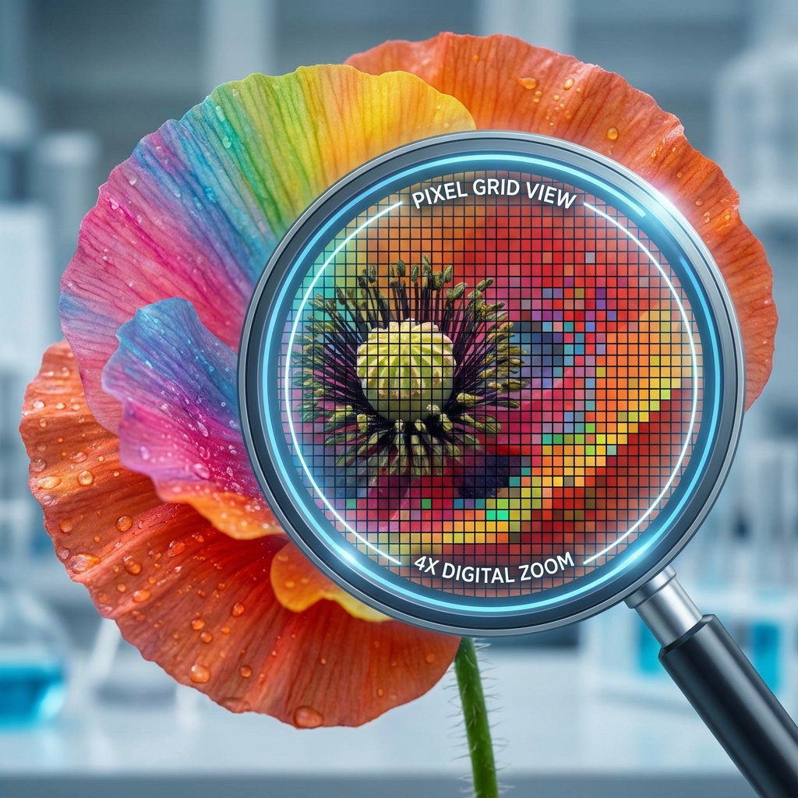

# Photographie Numérique

## 🤔 Introduction

La photographie numérique a remplacé la photographie argentique (chimique) dans la quasi-totalité des usages courants. Mais qu'est-ce qu'une image pour un ordinateur ? Comment passe-t-on de la lumière réelle à une suite de 0 et de 1 ?

Dans ce cours, nous allons découvrir la structure d'une image matricielle, comment les couleurs sont codées et comment manipuler ces données.

## ⌛ Point historique

*   **1861** : Première photographie couleur réalisée par le physicien **James Clerk Maxwell**.
*   **1957** : Première image numérique produite par un ordinateur (un scan de bébé) par Russell Kirsch.
*   **1969** : Invention du capteur **CCD** par Willard Boyle et George Smith (Prix Nobel 2009).
*   **1991** : Premier appareil photo numérique commercial, le Kodak DCS-100 (1.3 mégapixels).

## Définitions

!!! note "Pixel"

    Le pixel (contraction de *Picture Element*) est le plus petit élément constitutif d'une image numérique. Il représente un point de couleur ou de lumière.

!!! example "Exemple:"

    

    Si l'on zoom fortement sur une image, on peut apercevoir les petits carrés qui la composent : ce sont les pixels.

---

!!! note "Image matricielle"

    Une image numérique est une grille (ou matrice) rectangulaire de pixels composée de L colonnes (Largeur) et H lignes (Hauteur).

    - **La définition** correspond au nombre total de pixels (**Largeur × Hauteur**).
    - **La résolution** exprime la densité de pixels sur un support physique (en **ppp** ou **dpi**).

!!! example "Exemple:"

    Une image de 800x600 pixels possède une définition de 480 000 pixels.

## ⚫⚪ Images en Noir et Blanc et Niveaux de Gris

Pour qu'un ordinateur stocke une image, il doit transformer chaque pixel en nombre.

!!! note "Image binaire"

    C'est le format le plus simple. Chaque pixel ne peut prendre que deux états : soit **0** (Noir), soit **1** (Blanc). L'information est codée sur **1 bit**.

!!! example "Exemple : Codage d'un cœur (8x6 pixels)"

    **Vue "Machine" (Les données) :**

    | | | | | | | | |
    |:-:|:-:|:-:|:-:|:-:|:-:|:-:|:-:|
    | 0 | 1 | 1 | 0 | 0 | 1 | 1 | 0 |
    | 1 | 1 | 1 | 1 | 1 | 1 | 1 | 1 |
    | 1 | 1 | 1 | 1 | 1 | 1 | 1 | 1 |
    | 0 | 1 | 1 | 1 | 1 | 1 | 1 | 0 |
    | 0 | 0 | 1 | 1 | 1 | 1 | 0 | 0 |
    | 0 | 0 | 0 | 1 | 1 | 0 | 0 | 0 |

    **Vue "Image" (Le rendu) :**

    ⬜⬛⬛⬜⬜⬛⬛⬜  
    ⬛⬛⬛⬛⬛⬛⬛⬛  
    ⬛⬛⬛⬛⬛⬛⬛⬛  
    ⬜⬛⬛⬛⬛⬛⬛⬜  
    ⬜⬜⬛⬛⬛⬛⬜⬜  
    ⬜⬜⬜⬛⬛⬜⬜⬜  

    Sur ce schéma, chaque case **noire** correspond à un `1` et chaque case **blanche** à un `0`.

---

!!! note "Niveaux de Gris"

    Pour obtenir plus de nuances, on code chaque pixel sur **1 octet (8 bits)**. Cela permet d'avoir **256** valeurs possibles (de 0 à 255).

    *   **0** : Noir absolu
    *   **255** : Blanc pur
    *   **128** : Gris moyen

!!! example "Exemple:"

    

    Une ligne de 4 pixels : [Noir, Gris foncé, Gris clair, Blanc]
    S'écrira en machine : `[0, 80, 200, 255]`.

## 🎨 Les Images en Couleur

!!! note "Le modèle RVB"

    L'œil humain perçoit les couleurs grâce à 3 types de cônes (Rouge, Vert, Bleu). Les écrans utilisent le même principe : la **synthèse additive**.
    Chaque pixel couleur est composé de 3 sous-pixels (canaux) : **Rouge, Vert et Bleu**. Chacun est codé sur un octet (0 à 255).

!!! example "Exemple:"

    | Couleur | Rouge (R) | Vert (V) | Bleu (B) | Rendu |
    | :--- | :---: | :---: | :---: | :---: |
    | **Rouge** | 255 | 0 | 0 | 🟥 |
    | **Jaune** | 255 | 255 | 0 | 🟨 |
    | **Cyan** | 0 | 255 | 255 | 🟦 (Cyan) |
    | **Blanc** | 255 | 255 | 255 | ⬜ |

---

!!! note "Poids d'une image"

    Le poids d'une image dépend de sa définition et de son codage. En couleur RVB (24 bits), chaque pixel utilise 3 octets.

!!! example "Exemple:"

    Une image de **1000 × 1000** pixels en couleur pèse :
    **1 000 000 pixels × 3 octets = 3 000 000 octets ≈ 3 Mo**

## 🗂️ Formats et Métadonnées

!!! note "Formats de fichiers"

    *   **JPEG** : Compression **avec perte**. Idéal pour les photos (poids réduit).
    *   **PNG** : Compression **sans perte**. Gère la transparence.

!!! note "Métadonnées (EXIF)"

    Ce sont des "données sur les données". Elles sont enregistrées dans le fichier au moment de la prise de vue.

!!! example "Exemple de données EXIF:"

    - **Date/Heure** : 12/05/2023 14:30
    - **Appareil** : iPhone 13
    - **Coordonnées GPS** : 48.8584° N, 2.2945° E (Tour Eiffel)
    - **Réglages** : ISO 100, f/1.8, 1/500s

## 💻 Manipulation en Python (PIL)

Le langage Python permet de manipuler les images pixel par pixel grâce à la bibliothèque `Pillow`.

!!! note "Bibliothèque Pillow"

    On utilise souvent `from PIL import Image` pour charger et modifier des images.

!!! example "Code Python:"

    ```python
    from PIL import Image

    # Ouvrir l'image
    img = Image.open("photo.jpg")
    largeur, hauteur = img.size

    # Accéder à un pixel
    r, v, b = img.getpixel((10, 20))

    # Inverser les couleurs (négatif)
    nouveau_pixel = (255-r, 255-v, 255-b)
    ```