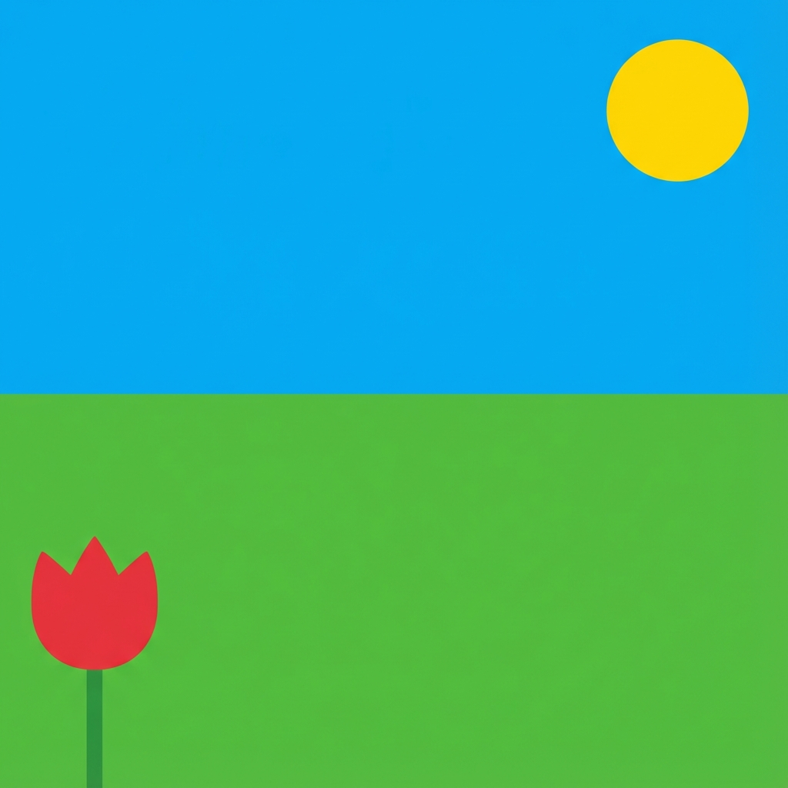

# 💻 Travaux Pratiques : Traitement d'Image avec Python

L'objectif de ce TP est d'apprendre à manipuler des images numériques pixel par pixel à l'aide du langage Python et de la bibliothèque **Pillow** (PIL).

## 0. Préparation

Les fichiers nécessaires sont :

- [image_tp.jpg](../../img/image_tp.jpg){:download="image_tp.jpg"} : image à utiliser pour les tests.
- [image_cachee.jpg](../../img/image_cachee.jpg){:download="image_cachee.jpg"} : image mystère pour l'activité 5. **À mettre dans le même dossier que le code.**
- [code_pillow.py](code_pillow.py){:download="code_pillow.py"} : contient le programme interactif complet.

### 🖼️ Aperçu de l'image de test
Voici l'image `image_tp.jpg` que vous allez manipuler (clic droit > Enregistrer sous si besoin) :

{ width="300" }

### 📥 Instructions de lancement

1. **Téléchargez les trois fichiers** ci-dessus.
2. **Placez-les impérativement dans le même dossier**.
3. **Ouvrez `code_pillow.py`** avec votre éditeur (IDLE, Thonny, VS Code).
4. **Lancez le programme** : un menu s'affiche dans la console.

---

## Activité 1 : Ouvrir et Analyser une image
**🎯 Objectif : Comprendre comment Python "voit" une image.**

Dans le menu, choisissez l'option **1**. Observez la console :

- Les dimensions (Largeur x Hauteur) s'affichent.
- Les composantes **R, V, B** du pixel central sont extraites.

!!! question "À réfléchir"
    Dans le code de la fonction `activite_1()`, décommentez la ligne qui tente de lire le pixel aux coordonnées `(largeur, hauteur)`. Pourquoi cela provoque-t-il une erreur alors que ce sont les dimensions de l'image ?

---

## Activité 2 : Créer le Négatif d'une image
**🎯 Objectif : Utiliser une boucle pour modifier chaque pixel.**

Le négatif consiste à inverser la luminosité. Si une valeur est `0` (noir), elle devient `255` (blanc).
La formule est simple : `valeur_neuve = 255 - valeur_ancienne`.

**Instructions :**

- Choisissez l'option **2** dans le menu.
- Allez dans la fonction `activite_2()` de votre fichier Python.
- Remplacez les `None` pour calculer `v_new` et `b_new` sur le même modèle que `r_new`.

```python
# Dans activite_2() :
r_new = 255 - r
v_new = None  # À COMPLÉTER
b_new = None  # À COMPLÉTER
```

---

## Activité 3 : Passage en Niveaux de Gris
**🎯 Objectif : Manipuler les couleurs pour transformer l'aspect.**

Pour transformer de la couleur en gris, on calcule la **moyenne** des trois composantes.

**Instructions :**

- Choisissez l'option **3**.
- Dans `activite_3()`, remplacez les `None`.
- **Attention :** En informatique, un pixel doit être un entier. Utilisez l'opérateur `//` pour une division entière.

```python
# Dans activite_3() :
moyenne = (r + v + b) // 3
r_new = None  # À COMPLÉTER
v_new = None  # À COMPLÉTER
b_new = None  # À COMPLÉTER
```

---

## Activité 4 : Effet "Filtre Rouge"
**🎯 Objectif : Écrire sa propre boucle de parcours.**

Ici, nous voulons supprimer totalement le Vert et le Bleu pour ne garder que le canal Rouge.

**Instructions :**

- Choisissez l'option **4**.
- Dans `activite_4()`, vous devez écrire les boucles `for` pour parcourir toute l'image (utilisez les activités précédentes comme modèle).
- Mettez les canaux de vert et bleu à `0`.

---

## Activité 5 : Stéganographie (Le message caché) 🕵️‍♂️
**🎯 Objectif : Révéler des informations invisibles à l'œil nu.**

Certaines images semblent noires, mais contiennent des variations infimes (par exemple un bleu à `1` au lieu de `0`). En multipliant cette valeur par `255`, on rend l'information visible.

**Instructions :**

- Choisissez l'option **5**.
- Dans `activite_5()`, multipliez la composante `b` par `255` pour révéler la forme cachée.

```python
# Dans activite_5() :
b_new = b * 255
```

!!! tip "Défi final"
    Une fois que tout fonctionne, essayez de créer votre propre filtre (ex: filtre Sépia ou augmenter le contraste) en créant une nouvelle option dans le menu !