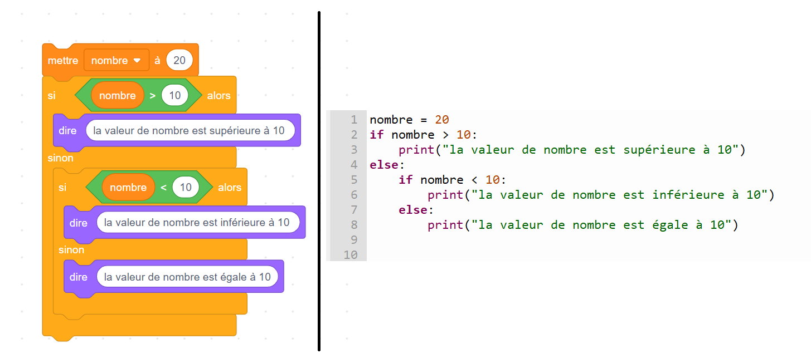
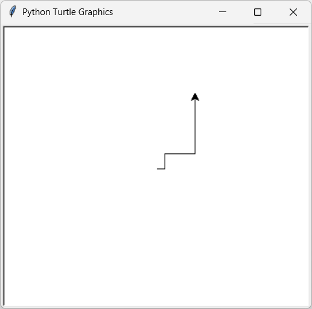
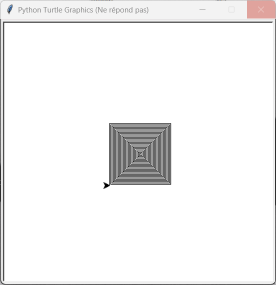
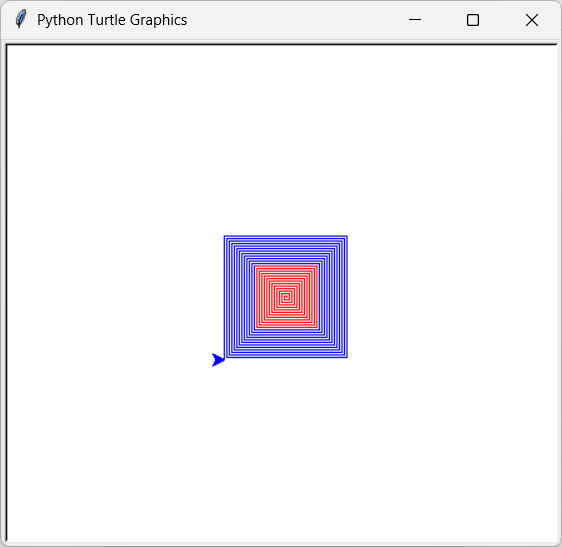
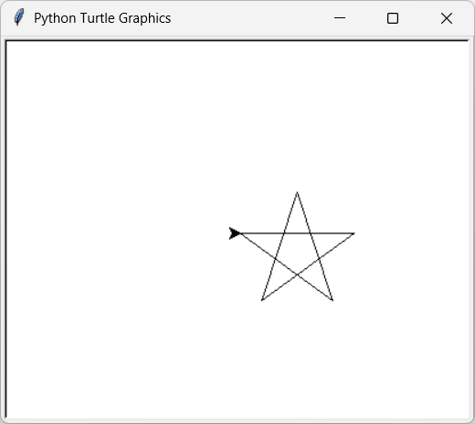
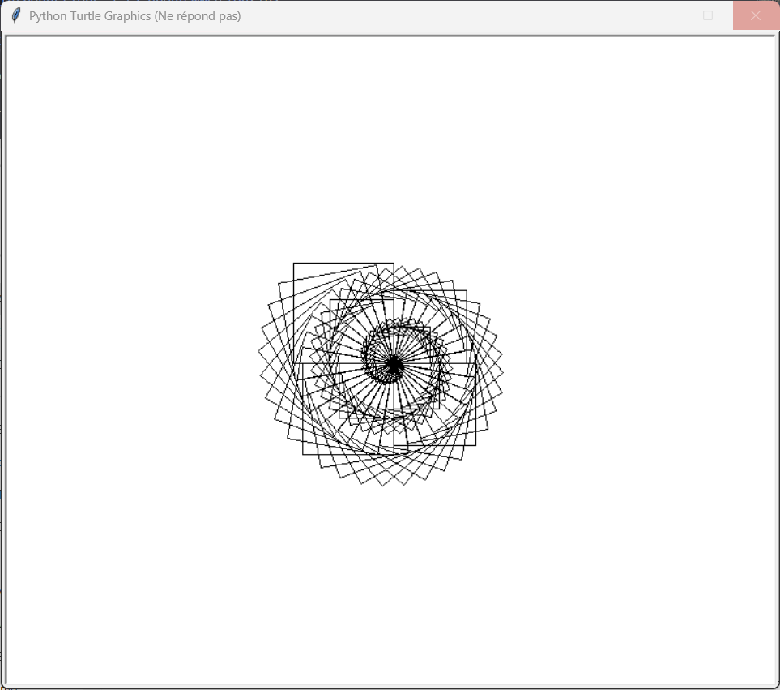

# <u>Introductions à la programmation</u>

## <u>Introduction</u>

Lors de vos années au collège, vous avez programmé en utilisant la programmation par blocs. Bien que ce type de langage ait des avantages pour comprendre les bases de la programmation, il reste limité.

C’est pour cela qu’au lycée, nous allons utiliser la programmation en *Python*. Ce langage n’est pas exclusif à la SNT, mais est également utilisé en mathématiques, en physique-chimie et en NSI.

### Python, c’est bien 👍

Il est possible de réaliser l’ensemble des choses effectuées avec Scratch dans Python (comme dans l’exemple ci-dessous), et bien plus encore !



## <u>La programmation en 2 mots</u>

rappel: La programmation, c’est dire à un ordinateur **quoi faire** en utilisant un langage qu’il peut comprendre.
Un programme est donc une **suite d’instructions** que la machine exécute pas à pas.

👉 Exemple très simple en Python :

```py
print("Bonjour !")
```

Ici, l’ordinateur affichera le texte **Bonjour !** à l’écran.

La programmation permet de :

* **Automatiser** des tâches (répéter rapidement ce qui serait long à faire à la main).
* **Créer** des dessins, des jeux, des applications, etc.
* **Résoudre des problèmes** en traduisant une idée en suite d’instructions.

⚡ Retenez :

* L’ordinateur **ne réfléchit pas tout seul** → il fait exactement ce qu’on lui dit.
* La programmation, c’est comme apprendre une **nouvelle langue** pour dialoguer avec lui.

!!! note "commentaire"

    ⚠️ Dans la suite de cette introduction, vous verrez dans les codes proposés
    le symbole # disséminé un peu partout.

    Ce symbole indique un commentaire, c’est-à-dire une indication destinée au
    lecteur du programme.
    
    Un commentaire sert uniquement à expliquer le code : il n’a aucune influence
    sur l’exécution du programme.


## <u>Turtle</u>

Il est possible, dans Python, d’importer ce que l’on appelle des **modules**. Ces modules sont des programmes créés par d’autres utilisateurs, permettant d’avoir accès à de nouvelles possibilités.

Aujourd’hui, nous allons utiliser le module **Turtle**, qui va nous permettre de dessiner en utilisant Python.

!!! note "Histoire de Turtle"

    Le module Turtle est inspiré d’un langage de programmation à but éducatif nommé *Logo*, créé en 1967.  

    Ce langage permettait de dessiner à l’aide d’une tortue sur une feuille numérique.  

    Tombé en désuétude aujourd’hui, *Logo* a néanmoins été repris bien des années plus tard dans Python afin de pouvoir, comme à l’époque, introduire la programmation aux débutants.  

### Mise en place

Afin de pouvoir utiliser Turtle et programmer, il nous faut une application permettant d’écrire notre programme.
Durant cette année, nous allons utiliser l’application **Thonny**, présente sur votre bureau.

!!! note "thonny"

    Thonny est un logiciel pour programmer en Python, très utilisé en SNT car il est simple :

    - on écrit le code dans l’éditeur,
    
    - on lance avec ▶ et le résultat apparaît dans la console,
    
    - On peut suivre pas à pas l’exécution et voir les variables changer à l’aide du débogueur (nous verrons plus tard cet outil).

    - On peut sauvegarder et charger des codes faits précédemment.

Commençons tout d’abord par importer notre module *turtle* avec la commande :

```py
from turtle import *
```

Cette commande signifie que l’on veut importer **tout** (symbolisé par `*`) depuis le module *turtle*.

Nous allons ensuite afficher la feuille sur laquelle nous ferons se déplacer notre tortue avec le code suivant :

```py
from turtle import *

reset()
```

Nous sommes maintenant prêts à dessiner pour la suite de cette activité.

### Possibilités

**Avancer :**

```py
forward(100)
# avec 100 correspondant à la longueur du trait
```

**Tourner à gauche :**

```py
left(90)
# avec 90 correspondant à l’angle que va prendre la tortue
```

**Tourner à droite :**

```py
right(90)
# avec 90 correspondant à l’angle que va prendre la tortue
```

**Changer la couleur :**

```py
color("blue")
# avec "blue" correspondant à la couleur (en anglais) utilisée par la tortue pour dessiner la suite
```

!!! note "activité 1"

    Réalisez l’image suivante, où l’ensemble des traits est de longueur 100 à l'aide de Turtle.  

      

### Variables

Afin d’éviter de répéter plusieurs fois le même nombre dans notre code, on utilise ce que l’on appelle des **variables**.
Ces variables permettent de stocker une donnée (une information).

**Exemple :**

```py
x = 100
```

Ces variables ont également la possibilité d’être modifiées.

**Exemple :**

```py
x = 100
x = x - 1
```

Enfin, il est possible d’utiliser les variables dans les fonctions (nous reviendrons sur ce terme plus tard) vues précédemment.

**Exemple :**

```py
x = 100
forward(x)
```

!!! note "activité 2"

    Réalisez l’image suivante, où le premier trait est égal à 10 et double à chaque nouveau trait à l'aide de Turtle.  

      

    Indice : la multiplication entre deux nombres s’effectue avec l’opérateur `*`  

!!! note "activité 3"

    Tu viens de souscrire à un abonnement téléphonique pour ton téléphone portable. Chaque mois, l’opérateur te facture :

    - **Frais fixes mensuels** : 10 €
    - **Prix par minute d’appel** : 0,05 €
    - **Prix par SMS** : 0,02 €

    Tu souhaites savoir combien va te coûter ton forfait en fonction de ton utilisation. Pour cela, tu décides de faire un petit programme Python.

    1. Définis des **variables** pour représenter :

        * le nombre de minutes (`minutes`)
        * le nombre de SMS (`sms`)

    2. Écris une formule (ou un petit programme Python) qui calcule le **coût total** du mois en fonction de ces variables.

    3. Calcule le coût pour :

        * 120 minutes et 50 SMS
        * 300 minutes et 10 SMS

!!! note "activité 4"

    On considère le programme suivant :

    ```python
    distance = 150   # en kilomètres
    temps = 3        # en heures
    vitesse = distance / temps
    print("La vitesse moyenne est de", vitesse, "km/h")
    ```

    ### Questions

    1. Quelle est la valeur de la variable `distance` ?
    2. Quelle est la valeur de la variable `temps` ?
    3. Quelle opération est effectuée pour calculer la variable `vitesse` ?
    4. Quelle est la valeur finale de `vitesse` ?
    5. Quel sera le message affiché par le programme ?


### Boucles

Supposons que l’on veuille effectuer plusieurs fois la même action : il est possible d’utiliser une **boucle**.
Celle-ci nous permet de ne pas écrire plusieurs fois la même chose.

Par exemple, le code suivant :

```py
reset()
x = 100

forward(x)
left(90)
forward(x)
right(90)

forward(x)
left(90)
forward(x)
right(90)

forward(x)
left(90)
forward(x)
right(90)
```

peut être remplacé par :

```py
reset()
x = 100
for i in range(3):
    forward(x)
    left(90)
    forward(x)
    right(90)
```

!!! note "activité 5"

    Réalisez l’image suivante en utilisant une boucle `for` à l'aide de Turtle.  

      
    
!!! note "activité 6"

    On considère le programme suivant :

    ```python
    for i in range(4):
        print("SNT est génial !")
    ```

    ### Questions

    1. Combien de fois la boucle s’exécute-t-elle ?
    3. Quelle est la phrase affichée par le programme ?
    4. Recopie exactement ce que le programme affichera à l’écran (ligne par ligne).


Regardons maintenant de plus près la ligne suivante :

```py
for i in range(3):
```

* `range(n)` crée un ensemble d’éléments partant de 0 jusqu’à `n-1`.
  → Dans l’exemple précédent, `range(3)` crée les éléments **0, 1, 2**.

* La boucle se lance, et la variable `i` (appelée *indice*) va prendre successivement les valeurs créées par `range(n)`.

Dans l’exemple précédent, cela donne :

| Position dans le code         | Valeur de `i` |
| ----------------------------- | ------------- |
| Avant d’entrer dans la boucle |               |
| 1ʳᵉ itération (tour)          | 0             |
| 2ᵉ itération (tour)           | 1             |
| 3ᵉ itération (tour)           | 2             |
| Une fois sorti de la boucle   |               |


Il est possible d’utiliser `i` comme une variable au sein de la boucle, comme dans l’exemple suivant :

```py
resultat = 0
for i in range(10):
    resultat = resultat + i
```

Ici, `resultat` va être égal à la somme des éléments de 0 à 9 (10 étant exclu), soit :

$$0 + 1 + 2 + 3 + \dots + 8 + 9 = 45$$

!!! note "activité 7"

    Réalisez l’image suivante en utilisant une boucle `for` et en exploitant la variable `i` à l'aide de Turtle.  

      

!!! note "activité 8"

    Écris un programme en Python qui :

    1. Affiche les nombres de 1 à 5.
    2. Pour chaque nombre, affiche aussi son carré (le nombre multiplié par lui-même).

    Le résultat attendu doit être de la forme :

    ```
    Le carré de 1 est 1
    Le carré de 2 est 4
    Le carré de 3 est 9
    Le carré de 4 est 16
    Le carré de 5 est 25
    ```

    ### Aide

    * Utilise une **boucle `for`** avec `range(1, 6)`.
    * Utilise une variable (par exemple `carre`) pour stocker le résultat du calcul.
    * Utilise `print()` pour afficher le texte au format suivant `print("le carré de",?,"est",?)` en remplacant les ?


### Conditions

En Python, il est également possible de faire des choix entre plusieurs possibilités. Cela s’appelle les **conditions**.
La syntaxe est la suivante :

```py
if condition_1:
    # faire cette partie
elif condition_2:
    # faire cette partie
else:
    # faire cette partie
```

Trois termes sont utilisés ici :

* **if** : signifie *si* en français.
  → Si la condition qui suit est vraie, alors la partie en dessous est exécutée.

* **elif** : signifie *sinon si* en français.
  → Si la condition précédente est fausse et que la condition qui suit est vraie, alors la partie en dessous est exécutée.

* **else** : signifie *sinon* en français.
  → Si toutes les conditions précédentes sont fausses, alors la partie en dessous est exécutée.

**Exemple :**

```py
x = 100
if x < 20:
    print("x est inférieur à 20")
elif x > 20:
    print("x est supérieur à 20")
else:
    print("x est égal à 20")
```

Essayez ce programme en modifiant la valeur de `x` pour comprendre comment fonctionnent les conditions.

!!! note "activité 9"

    Reprenez votre code précédent en faisant en sorte que la couleur de votre pinceau soit **rouge** lorsque `i < 50`, et **bleue** sinon à l'aide de Turtle.

      

!!! note "activité 10"

    Écris un programme en Python qui :

    1. Demande à l’utilisateur de saisir son âge (utilise `input()`).
    2. Si l’âge est **supérieur ou égal à 18**, affiche :

    ```
    Tu es majeur.
    ```
    3. Sinon, affiche :

    ```
    Tu es mineur.
    ```

    ### Exemple d’exécution

    ```
    Entre ton âge : 16
    Tu es mineur.
    ```

    ```
    Entre ton âge : 20
    Tu es majeur.
    ```

    ### Aide

    * Utilise la fonction `input()` de ma maniere suivante: input("Entre ton âge : ") pour pouvoir interroger l'utilisateur.
    * Utilise une condition `if ... else`.

!!! note "activité 11"

    On considère le programme suivant :

    ```python
    note = 14

    if note >= 16:
        print("Mention Très Bien")
    elif note >= 14:
        print("Mention Bien")
    elif note >= 12:
        print("Mention Assez Bien")
    elif note >= 10:
        print("Mention Passable")
    else:
        print("Échec")
    ```

    ### Questions

    1. Quelle est la valeur de la variable `note` au début du programme ?
    2. Quelle est la première condition testée par le programme ? Est-elle vraie ou fausse ici ?
    3. Quelle condition sera vraie dans ce cas précis ?
    4. Quel sera le message affiché par le programme ?
    5. Que se passerait-il si `note = 9` ?


### Fonctions

Pour conclure cette partie, Python permet la création et l’utilisation de **fonctions**, qui sont des blocs de code réutilisables plusieurs fois par la suite.

Si, par exemple, je voulais écrire quelque chose comme :

```py
forward(10)
left(90)
forward(10)
right(90)

color('blue')

forward(10)
left(90)
forward(10)
right(90)

color('red')

forward(10)
left(90)
forward(10)
right(90)
```

On pourrait créer une fonction de la forme suivante :

```py
def fonction_1():
    forward(10)
    left(90)
    forward(10)
    right(90)
```

Cette fonction porte le nom de `fonction_1`, et nous pouvons ensuite l’utiliser dans notre code :

```py
def fonction_1():
    forward(10)
    left(90)
    forward(10)
    right(90)

fonction_1()
color('blue')
fonction_1()
color('red')
fonction_1()
```

!!! note "activité 12"

    Créez une fonction `carre` qui dessine un carré dont les côtés sont de longueur 100, puis utilisez-la afin de refaire l’image suivante à l'aide de Turtle:  

      

!!! note "activité 13"

    On considère le programme suivant :

    ```python
    def message_bienvenue():
        print("Bienvenue en SNT !")
        print("Amuse-toi bien avec le code !")

    message_bienvenue()
    message_bienvenue()
    ```

    ### Questions

    1. Quel est le nom de la fonction définie dans ce programme ?
    2. Cette fonction prend-elle des paramètres ?
    3. Que fait cette fonction lorsqu’elle est appelée ?
    4. Combien de fois la fonction est-elle exécutée ici ?
    5. Que sera affiché exactement à l’écran après l’exécution complète du programme ?


Il est également possible d’utiliser une autre fonctionnalité des fonctions : les **paramètres**.

Reprenons la fonction faite précédemment :

```py
def fonction_1():
    forward(10)
    left(90)
    forward(10)
    right(90)
```

On veut maintenant préciser la longueur des traits lorsque l’on utilise la fonction.
Pour cela, on va créer un paramètre `longueur` dans notre fonction :

```py
def fonction_2(longueur):
    forward(longueur)
    left(90)
    forward(longueur)
    right(90)
```

Nous pouvons maintenant l’utiliser en appelant la fonction avec une valeur :

```py
def fonction_2(longueur):
    forward(longueur)
    left(90)
    forward(longueur)
    right(90)

fonction_2(50)
color('blue')
fonction_2(100)
color('red')
fonction_2(200)
```

Enfin, il est possible d’utiliser **plusieurs paramètres en même temps** :

```py
def fonction_3(longueur, angle):
    forward(longueur)
    left(angle)
    forward(longueur)
    right(angle)

fonction_3(100, 90)
```

!!! note "activité 14"

    Reprenez votre fonction `carre` créée précédemment en y ajoutant un paramètre pour la longueur des côtés.  
    Écrivez ensuite un code permettant de refaire l’image suivante à l'aide de Turtle :  

      

!!! note "activité 15"

    1. Écris une **fonction** appelée `carre` qui :

        * prend un nombre en entrée,
        * renvoie le **carré** de ce nombre.

    2. Ensuite, utilise cette fonction pour :

        * calculer le carré de 5,
        * afficher le résultat avec `print()`.


    ### Exemple d’exécution attendue

    ```
    Le carré de 5 est 25
    ```

    ### Aide

    * Une fonction se définit avec `def nom_de_fonction(parametre):`
    * Pour renvoyer une valeur, utilise `return`.
    * Exemple de structure :

    ```python
    def carre(nombre):
        # calcul du carré
        return ...
    ```

### pour allée plus loin

!!! note "activité complementaire"

    reproduisez les dessins suivants:

     
    

