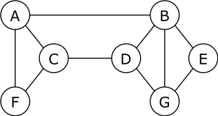

# exercices

## exercice 1

Répondez aux questions suivante:

1. Combien de sommets comporte ce graphe ?
2. Combien d'arêtes comporte ce graphe ?
3. Quels sommets sont voisins du sommet D ?
4. Quel est le degré de chaque sommet ?
5. Quelle est l'excentricité de chaque sommet ?
6. Quel est le rayon de ce graphe ?
7. Quel est le diamètre de ce graphe ?
8. Quels sommets composent le centre du graphe ?

---

## exercice 2

À partir de la liste suivante de relations, construisez un graphe représentant les liens entre les différentes personnes, puis déterminez le rayon, le diamètre ainsi que le ou les centres de ce graphe.

- Alice – Bob
- Alice – Chloé
- Alice – David
- Bob – Emma
- Bob – Farid
- Chloé – Emma
- Chloé – Hugo
- David – Farid
- David – Inès
- Emma – Hugo
- Farid – Inès
- Hugo – Julie
- Inès – Karim
- Julie – Karim
- Julie – Laura
- Karim – Laura

---

## exercice 3

On modélise une portion de métro :

Stations : 

- Gare, 
- Place, 
- Musée, 
- Port, 
- Parc

Correspondances :

- Gare ↔ Place
- Place ↔ Musée
- Musée ↔ Parc
- Place ↔ Port

Représenter ce réseau sous forme de graphe.

- Quel est le plus court trajet entre Gare et Parc ?

- Quelle station a le plus grand degré ?

- quelle station est le centre du graphe ?

## exercice 4

On considère un ensemble fictif de personnes et leurs relations d’amitié ci-dessous :

- Alice connaît Bob et Chloé.
- Bob connaît David.
- Chloé connaît Emma et Farid.
- David connaît Hugo.
- Emma connaît Julie.
- Farid connaît Karim.
- Karim connaît Laura.
- Julie connaît Laura.

Répondez aux questions suivante:

1. Représentez ces relations sous forme de graphe.

2. Déterminez la distance sociale entre :

    - Alice et Laura
    - Bob et Karim
    - Emma et David.

3. expliquez en quelques phrases en quoi cette situation illustre le phénomène du petit monde.

## exercice 5 : Trouver l’espion dans le réseau 

On modélise un petit réseau de communication entre agents secrets.

Les sommets représentent des agents, et les arêtes représentent des communications directes.

Les communications connues sont :

- A communique avec B et C
- B communique avec D et E
- C communique avec F
- D communique avec G
- E communique aussi avec G
- F ne communique qu’avec C
- G communique avec D et E

Questions :

1. Représenter ce réseau sous forme de graphe.

2. Donner le degré de chaque sommet.

3. Quel agent est probablement le plus central dans le réseau ? Justifier.

4. Un espion tente de perturber le réseau : il supprime la communication entre D et G.

6. Le graphe reste-t-il connexe ?

7. Si non, combien de composantes connexes contient-il désormais ?

8. Quel lien serait le plus stratégique à ajouter pour renforcer la connectivité du réseau ?

# 🟥 **Exercice avancé : Analyse d’un réseau de capteurs**

Une entreprise utilise un ensemble de **capteurs intelligents** placés dans un bâtiment.
Chaque capteur communique avec ceux qui sont suffisamment proches.
On modélise le système sous forme de graphe.

Les communications connues sont :

* C1 communique avec C2, C3 et C4
* C2 communique avec C3, C5 et C6
* C3 communique avec C6, C7
* C4 communique avec C7 et C8
* C5 communique avec C6 et C9
* C6 communique avec C7, C9 et C10
* C7 communique avec C8, C10 et C11
* C8 communique avec C11
* C9 communique avec C10
* C10 communique avec C11
* C11 ne communique que avec C7, C8 et C10

---

## **Questions**

1. **Représentez le réseau sous forme de graphe** (attention : il est étendu).

2. **Déterminez le degré de chaque capteur.**

3. **Calculez les distances** suivantes :   

    * d(C1, C11)
    * d(C4, C9)
    * d(C2, C8)
    * d(C5, C7)

4. **Calculez l’excentricité** de chaque capteur.

5. **Déterminez :**

    * Le **rayon** du graphe
    * Le **diamètre** du graphe
    * Le(s) **centre(s)** du graphe

6. L’entreprise craint une coupure.   
   On supprime le lien entre **C6 et C7**.

    * Le graphe reste-t-il connexe ?
    * Si non, combien de **composantes connexes** apparaissent ?
    * Quels capteurs se retrouvent isolés dans chaque composante ?

7. Proposez **un lien minimal** à ajouter pour garantir que le réseau devienne à nouveau connexe.

8. Enfin, proposez **un lien stratégique** (pas forcément minimal) qui améliorerait significativement la robustesse du réseau (justifiez).
