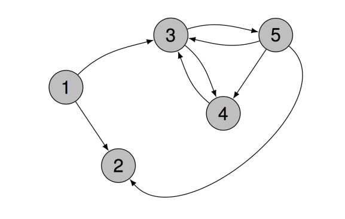

# 🌐 Thème : Le Web

--- 

## histoire du web

### selon vous, de quand date la création du web ?

---

## histoire du web

### selon vous, de quand date la création du web ?

le web est né en 1989 au CERN (Genève) créé par Tim Berners-Lee pour permettre aux scientifiques de partager leurs recherches sans dépendre d'un logiciel spécifique.

---

## qu'est-ce que le web ?

### selon vous, qu'est-ce que le web ?

---

## qu'est-ce que le web ?

### selon vous, qu'est-ce que le web ?

le web est un ensemble de pages web reliées entre elles par des liens hypertextes (liens permettant de naviguer de page en page). 

---

## qu'est-ce que le web ?

### quelle est la différence entre le web et internet ?

---

## qu'est-ce que le web ?

### quelle est la différence entre le web et internet ?

la différence entre le web et internet est qu'internet est l'infrastructure matérielle mondiale (câbles, routeurs, ondes, serveurs et protocole TCP/IP) tandis que le web est un service spécifique utilisant internet pour échanger des documents reliés par des liens.

---

## qu'est-ce que le web ?

### principe du client serveur

le web fonctionne selon le principe du client serveur :

- le client est le navigateur web qui demande une page web

- le serveur est l'ordinateur qui héberge le site web et qui renvoie la page web demandée

---

## qu'est-ce que le web ?

### principe du client serveur

---

## url

### qu'est-ce qu'une url ?

une url (Uniform Resource Locator) est une adresse unique qui permet d'accéder à une ressource sur le web. 

---

## url

### comment se compose une url ?

une url est composée de plusieurs parties :

- protocole : `https://`
- nom de domaine : `www.education.gouv.fr`
- chemin : `/programme-snt.html`
- paramètres : `?lang=fr`

---

## url

### comment se compose une url ?

### protocole

le protocole est la méthode de communication utilisée entre le client et le serveur. 

ici `https://` est le protocole. 

ce protocole permet d'échanger des informations entre le client et le serveur de manière sécurisée.

---

## url

### comment se compose une url ?

### nom de domaine

le nom de domaine est l'adresse lisible par l'humain qui identifie un serveur sur Internet.

ici `www.education.gouv.fr` est le nom de domaine.

---

## url

### comment se compose une url ?

### nom de domaine

le nom de domaine est l'adresse lisible par l'humain qui identifie un serveur sur Internet.

à la base les adresses web sont une suite de chiffres : l'adresse IP 

cette adresse IP est transformée en nom de domaine par le DNS (Domain Name System)

exemple: l'adresse 142.251.209.131

---

## url

### comment se compose une url ?

### nom de domaine

le nom de domaine donne des informations sur le site web. 

- `www` : le fait qu'il y ait `www` (world wide web) indique que c'est un site web
- `education` : le nom du site
- `gouv` : le type de site
- `.fr` : le pays

---

## url

### comment se compose une url ?

### chemin

le chemin est l'adresse de la ressource sur le serveur. 

ici `/programme-snt.html` est le chemin.

c'est-à-dire le fichier qui est demandé au serveur.

---

## url

### comment se compose une url ?

### paramètres

les paramètres sont des informations supplémentaires qui sont envoyées au serveur. 

ici `?lang=fr` est le paramètre.

c'est-à-dire que le serveur doit renvoyer la page en français.

---

Exercice d'Analyse d'URL

**Étudiez l'URL suivante et identifiez ses composants avec précision :**  
`https://moodle.lycee.fr/login/recherche.php?cat=SNT&annee=2024`

**Questions d'investigation :**
1. Quel est le **nom de domaine principal** ? S'agit-il d'un site commercial ou institutionnel ?
2. Identifiez le **Chemin** et les **Paramètres**.
3. **Défi de déduction :** Si vous changez `2024` par `2023` dans cette URL, que va-t-il probablement se passer au niveau du serveur ?
4. **Création :** Écrivez l'URL d'un site fictif `cinema.fr` qui chercherait un film nommé `Matrix` via un paramètre `titre`.

---

## les moteurs de recherche

### qu'est-ce qu'un moteur de recherche ?

---

## les moteurs de recherche

### qu'est-ce qu'un moteur de recherche ?

un moteur de recherche est un logiciel qui permet de rechercher des informations sur le web. 

---

## les moteurs de recherche

### qu'est-ce qu'un moteur de recherche ?

un moteur de recherche est un logiciel qui permet de rechercher des informations sur le web. 

### exemples de moteurs de recherche ?

---

## les moteurs de recherche

### qu'est-ce qu'un moteur de recherche ?

un moteur de recherche est un logiciel qui permet de rechercher des informations sur le web. 

### exemples de moteurs de recherche ?

- google
- bing
- qwant
- yahoo
- ecosia
- ...

---

## les moteurs de recherche

### quelle est la différence entre un moteur de recherche et un navigateur web ?

---

## les moteurs de recherche

### quelle est la différence entre un moteur de recherche et un navigateur web ?

un navigateur web permet d'accéder aux pages web

un moteur de recherche permet de rechercher des informations sur le web

---

## les moteurs de recherche

### quelle est la différence entre un moteur de recherche et un navigateur web ?

un navigateur web permet d'accéder aux pages web

un moteur de recherche permet de rechercher des informations sur le web

### exemples de navigateurs web ?

---

## les moteurs de recherche

### quelle est la différence entre un moteur de recherche et un navigateur web ?

un navigateur web permet d'accéder aux pages web

un moteur de recherche permet de rechercher des informations sur le web

### exemples de navigateurs web ?

- google chrome
- mozilla firefox
- safari
- edge
- ...

--- 

## les moteurs de recherche

### comment fonctionne un moteur de recherche ?

prenons l'exemple de Google. comment fait-il pour trouver les pages web pertinentes ?

---

## les moteurs de recherche

### comment fonctionne un moteur de recherche ?

prenons l'exemple de Google. comment fait-il pour trouver les pages web pertinentes ?

1. crawler : le crawler est un programme qui parcourt le web et collecte des informations sur les pages web

2. indexation : l'indexation est le processus de stockage des informations collectées par le crawler

3. classement : le classement est le processus de classement des informations collectées par le crawler

---

## les moteurs de recherche

### comment fonctionne un moteur de recherche ?

le crawler utilise pour classer les pages web le critère suivant :

Plus une page reçoit de liens entrants provenant de sites eux-mêmes "importants", plus son **PageRank** augmente.

### exemple :

un site qui a 100 liens pointant vers lui est plus important qu'un site qui a 10 liens pointant vers lui

--- 

Activité : Le PageRank en action

**Consigne :**
Observez le schéma ci-dessous représentant un micro-réseau de 5 sites (1, 2, 3, 4, 5).

---

Activité : Le PageRank en action

**Questions :**
1.  **Analyse des Liens :**
    *   Quel site reçoit le plus de liens entrants  ?
    *   Quel site reçoit le moins de liens entrants ?

2.  **Application du Principe :**
    *   En appliquant la logique du PageRank (un lien d'un site important vaut plus qu'un lien d'un site faible), classez les sites de 1 à 5 par ordre de popularité décroissante (du plus important au moins important).

3.  **Déduction Logique :**
    *   Si vous deviez choisir un site pour y placer une publicité très visible, lequel choisiriez-vous et pourquoi ?

