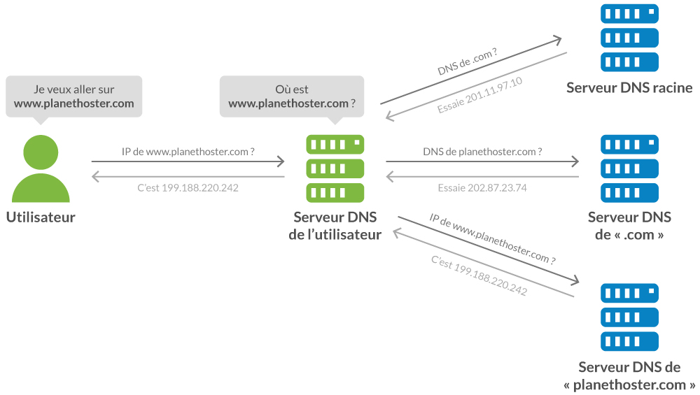
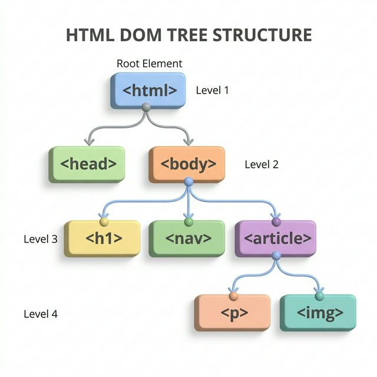

# 🌐 Thème : Le Web

---

# I. Genèse et Philosophie du Web

## 1. Le Web : Une toile de liens
Le Web (abrégé de *World Wide Web*) est né en **1989** au CERN (Genève). 
L'inventeur **Tim Berners-Lee** cherchait un moyen pour que les scientifiques puissent partager leurs recherches sans dépendre d'un logiciel spécifique.

---

## 2. Un standard ouvert et gratuit
- En **1993**, le CERN décide de placer le Web dans le **domaine public**.
- Contrairement aux réseaux propriétaires de l'époque, n'importe qui peut créer un site sans rien payer à une entreprise.
- Le **W3C** (*World Wide Web Consortium*) veille aujourd'hui à ce que le Web reste universel (interopérabilité).

---

## ⚠️ Ne confondons pas tout !

### Quel est la différence entre le web et internet ?

---

## ⚠️ Ne confondons pas tout !

Il est essentiel de distinguer le contenant du contenu :

| Notions | Définition |
| :--- | :--- |
| **Internet** | L'infrastructure matérielle mondiale : câbles, routeurs, ondes, serveurs et protocole TCP/IP. |
| **Le Web** | Un service spécifique utilisant Internet pour échanger des documents reliés par des liens. |

> **À retenir** : D'autres services utilisent Internet sans être le Web (ex: les emails, les jeux en ligne, le streaming vidéo direct).

---

# II. L'Infrastructure Technique

## Le Modèle Client-Serveur
Le Web repose sur un dialogue entre deux pôles :
- **Le Client** : Votre navigateur (demande une page).
- **Le Serveur** : Un ordinateur distant (fournit la page).

---

## Le Protocole HTTP en détail

**HTTP** (*HyperText Transfer Protocol*) est le protocole qui régit le **dialogue** entre le navigateur (client) et le serveur web. On distingue deux types de messages :

| Message | Émetteur | Rôle |
|:----|:----|:----|
| **Requête** | Le client (navigateur) | Demander une ressource |
| **Réponse** | Le serveur | Fournir la ressource demandée |

---

## Le cycle Requête / Réponse

1. Vous tapez `https://www.education.gouv.fr` dans votre navigateur.
2. Le navigateur envoie une **requête HTTP GET** au serveur.
3. Le serveur traite la demande et renvoie une **réponse HTTP** avec la page HTML.
4. Le navigateur interprète le HTML et affiche la page.

> C'est ce qu'on appelle le modèle **Client-Serveur**.

---

## Les codes de statut HTTP

Chaque réponse du serveur contient un **code de statut** à 3 chiffres :

| Code | Signification | Exemple |
|:----|:----|:----|
| **200** | ✅ OK — Succès | La page est trouvée et renvoyée |
| **301** | ↪️ Redirection permanente | La page a changé d'adresse |
| **403** | 🚫 Forbidden — Accès interdit | Vous n'avez pas les droits |
| **404** | ❌ Not Found — Introuvable | La page n'existe pas |
| **500** | 💥 Internal Server Error | Erreur côté serveur |

---

# III. L'URL

### Qu'est ce qu'une url ?

---

# III. L'URL

Chaque élément du Web possède une **URL** unique (*Uniform Resource Locator*).

<div class="highlight">
https://www.education.gouv.fr/programme-snt.html?lang=fr
</div>

---

## 1. Le Protocole (`https://`)
Il définit la méthode de communication utilisée entre le client et le serveur. 
Le **"S"** final (Secured) indique que les données sont **chiffrées** (cryptées) avant d'être envoyées, protégeant ainsi vos informations.

---

## 2. Le Nom de Domaine (`www.education.gouv.fr`)
C'est l'adresse lisible par l'humain qui identifie un serveur sur Internet. Il est composé de plusieurs parties lues **de droite à gauche** :

| Partie | Exemple | Rôle |
|:----|:----|:----|
| **TLD** (extension) | `.fr` | Zone géographique ou nature du site |
| **Domaine de 2ème niveau** | `gouv` | Nom enregistré auprès d'un registrar |
| **Sous-domaine** | `www` ou `education` | Subdivision du domaine principal |

---

## Les types d'extensions (TLD)

- **Géographiques** : `.fr` (France), `.de` (Allemagne), `.jp` (Japon)
- **Génériques** : `.com` (commercial), `.org` (organisation), `.net` (réseau)
- **Institutionnels** : `.gouv.fr` (gouvernement français), `.edu` (éducation, USA)
- **Nouveaux TLD** : `.app`, `.shop`, `.blog`

> **À retenir** : Un nom de domaine doit être **acheté et enregistré** auprès d'un registrar. Il est **unique** au monde.

---

## Le DNS

Les ordinateurs ne communiquent que via des **adresses IP** (ex: `142.250.7.14`). 
Le **DNS** (*Domain Name System*) agit comme un **annuaire téléphonique mondial** : il traduit le nom de domaine lisible en adresse IP compréhensible par les machines.

---

## le DNS en action



---

## 4. Le Chemin 

### Le Chemin (`/programme-snt.html`)
Il indique l'emplacement précis du fichier dans l'arborescence des dossiers du serveur.

exemple: `https://www.prof-leal.fr/SNT/Web/sommaire/`

---

## 5. Les Paramètres

### Les Paramètres (`?lang=fr`)
Les paramètres permettent d'**envoyer des informations au serveur** directement dans l'URL pour personnaliser la réponse.

- Ils commencent toujours par le symbole **`?`**
- Ils sont formés de paires **`clé=valeur`**
- On peut en chaîner **plusieurs** avec le symbole **`&`**

---

## Exemple de décomposition

<div class="highlight">
https://www.youtube.com/watch?v=dQw4w9WgXcQ&t=30
</div>

| Paramètre | Valeur | Signification |
|:----|:----|:----|
| `v` | `dQw4w9WgXcQ` | Identifiant de la vidéo |
| `t` | `30` | Démarrer à la seconde 30 |

> **À retenir** : Les paramètres sont **visibles dans l'URL**. Il ne faut jamais y faire passer un mot de passe !

---

<div class="activity">
<span class="activity-title">Exercice d'Analyse d'URL</span>

**Étudiez l'URL suivante et identifiez ses composants avec précision :**  
`https://moodle.lycee.fr/login/recherche.php?cat=SNT&annee=2024`

**Questions d'investigation :**
1. Quel est le **nom de domaine principal** ? S'agit-il d'un site commercial ou institutionnel ?
2. Identifiez le **Chemin** et les **Paramètres**.
3. **Défi de déduction :** Si vous changez `2024` par `2023` dans cette URL, que va-t-il probablement se passer au niveau du serveur ?
4. **Création :** Écrivez l'URL d'un site fictif `cinema.fr` qui chercherait un film nommé `Matrix` via un paramètre `titre`.

</div>

---

# IV. La Structure des Données : Le HTML

## 1. Séparation Fond / Forme
Pour construire une page, on utilise deux langages distincts :
- **HTML** (Structure) : Identifie la nature du contenu (**Ce que c'est**).
- **CSS** (Présentation) : Définit l'apparence (**À quoi ça ressemble**).

---

## 2. La logique des Balises (Tags)

```html
<p>Ceci est un paragraphe.</p>
```
*   `<p>` : Balise ouvrante.
*   `Ceci est...` : Le contenu sémantique.
*   `</p>` : Balise fermante (indispensable !).

---

## 3. L'Arborescence : Un arbre de données
Une page web n'est pas une simple suite de texte ; c'est une structure hiérarchique appelée **DOM** (*Document Object Model*).

### La logique de l'imbrication
- Comme des **poupées russes**, une balise est placée à l'intérieur d'une autre.
- On parle de relation **Parent / Enfant** : une balise "englobante" est la parente des balises qu'elle contient.

---



> **Exemple de lecture** : La balise `<html>` est la racine de l'arbre. Elle a deux enfants : `<head>` et `<body>`. Le titre `<h1>` est un enfant de `<body>`.

---

### Les balises sémantiques indispensables :
- `<h1>` à `<h6>` : Les titres hiérarchisés.
- `<a>` : Les liens (le cœur du Web).
- `` : Les images (insérées via un lien `src`).

---

<div class="activity">
<span class="activity-title">Exercice d'Architecture de Page</span>

**Mission :** Vous devez modéliser la structure HTML d'une page de profil d'élèves. 
Elle doit contenir :
1. Un titre principal (`<h1>`) avec le nom de l'élève.
2. Un lien hypertexte (`<a>`) vers le site du lycée.

**Questions de conception :**
1. Dans quelle grande section du document (Head ou Body) allez-vous placer ces éléments ?
2. Dessinez ou listez l'**imbrication** (l'arborescence) de ces balises pour respecter les standards du W3C.
3. **Défi :** Où placeriez-vous la balise `` pour qu'elle apparaisse juste avant le lien ?

</div>

---

# V. La Mise en Forme : Le CSS

Le **CSS** (*Cascading Style Sheets*) est le langage qui définit l'apparence de la page.

## 1. La séparation du fond et de la forme
- **HTML** = La structure (ex: "ceci est un titre").
- **CSS** = Le style (ex: "ce titre doit être bleu et en gras").

---

## 2. La syntaxe du CSS
On cible un élément (le **sélecteur**) et on lui applique des **propriétés**.

```css
h1 {
    color: blue;         /* Couleur du texte */
    font-size: 24px;     /* Taille de la police */
    text-align: center;  /* Alignement */
}
```

---

# VI. Moteurs de recherche et Sécurité

### Donnez des exemples de moteurs de recherche.

---

## exemple de moteur de recherche : 

- Google
- Bing
- Qwant
- Ecosia

---

## Qu'est-ce qu'un moteur de recherche ?

---

## 1. Qu'est-ce qu'un moteur de recherche ?
C'est un outil qui permet de trouver des informations parmi des milliards de pages web. Contrairement à une recherche directe, le moteur ne cherche pas "en direct" sur tout le Web, mais dans sa propre mémoire.

---

## Les 3 étapes du moteur :
1. **L'exploration (Crawling)** : Des robots parcourent les liens pour découvrir de nouvelles pages.
2. **L'indexation** : Les pages sont analysées et stockées dans une immense base de données.
3. **Le classement (Ranking)** : Le moteur décide quelle page est la plus pertinente pour vous.

---

## Comment fonctionne un moteur de recherche ? Comment trouver un site pertinent ?

---

## 2. L'algorithme PageRank
Comment Google décide-t-il quelle page est n°1 ?
C'est un **vote de popularité** par les liens : Plus une page reçoit de liens entrants provenant de sites eux-mêmes "importants", plus son **PageRank** augmente.

---

## 3. Les Cookies
Petits fichiers textes déposés sur votre ordinateur par les serveurs.
- **Utiles** : Mémoriser votre panier d'achat ou votre connexion.
- **Publicitaires** : Suivre votre navigation de site en site (**tracking**).
- **RGPD** : Obligation pour les sites de vous demander votre consentement.

---

# Quiz de Synthèse / Kahoot

https://play.kahoot.it/v2/?quizId=44c0ad0a-f379-40ea-990f-1f01e209bf72&hostId=1f7976de-31a1-4e76-bde3-438c3849588b