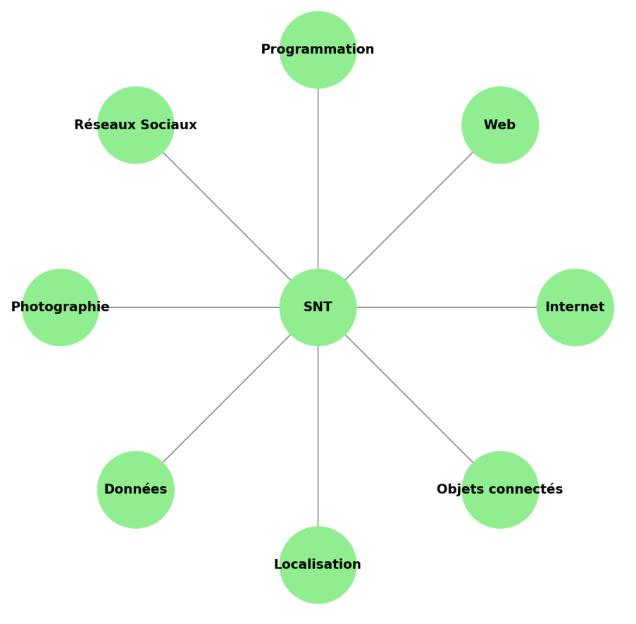

# Activité d’introduction

Le but de cette activité est de vous amener à réfléchir et à échanger autour des thèmes de la SNT.

Pour chacun des sommets proposés :

* Notez ce que vous pensez déjà connaître sur ce sujet.
* Formulez des questions sur ce que vous ne comprenez pas encore ou que vous aimeriez découvrir.

L’objectif n’est pas d’avoir “la bonne réponse”, mais de partager vos idées et vos curiosités.

